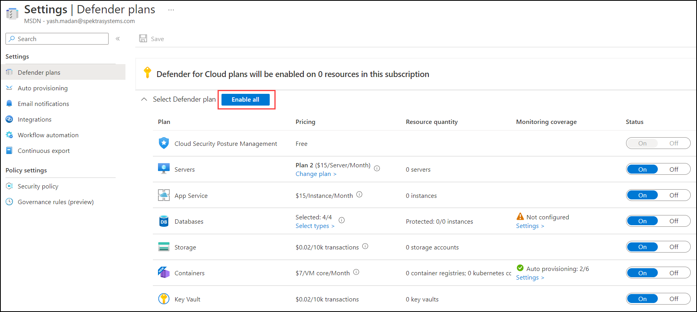

# Exercise 01: Azure Security Center/ Microsoft Defender for Cloud
## Lab objectives
In this lab, you will complete the following exercise:
1. Exploring Microsoft Defender for Cloud 
2. Configure Security Policies  
3. Secure Score 
4. Improving your Secure Posture 
5. Exploring Security Center and Security benchmark 

# Task 1: Exploring Microsoft Defender for Cloud

### What is Microsoft Defender for Cloud?

Microsoft Defender for Cloud is a Cloud Security Posture Management (CSPM) and Cloud Workload Protection Platform (CWPP) for all of your Azure, on-premises, and multicloud (Amazon AWS and Google GCP) resources. Defender for Cloud fills three vital needs as you manage the security of your resources and workloads in the cloud and on-premises:

- [**Defender for Cloud secure score**](secure-score-security-controls.md) **continually assesses** your security posture so you can track new security opportunities and precisely report on the progress of your security efforts.
- [**Defender for Cloud recommendations**](security-policy-concept.md) **secures** your workloads with step-by-step actions that protect your workloads from known security risks.
- [**Defender for Cloud alerts**](alerts-overview.md) **defends** your workloads in real-time so you can react immediately and prevent security events from developing.

Defender for Cloud secure score continually assesses your security posture so you can track new security opportunities and precisely report on the progress of your security efforts.
Defender for Cloud recommendations secures your workloads with step-by-step actions that protect your workloads from known security risks.
Defender for Cloud alerts defends your workloads in real-time so you can react immediately and prevent security events from developing.

1. In the VM, double click on the **Azure portal shortcut** on the desktop.

    
    
1. Click on the **Environment Details** tab located next to the Lab Guide tab and Copy the **Username and Password**.

    

1. Login to Azure with the username **<inject key="AzureAdUserEmail" />** and click on **Next**.

    

1. Enter password **<inject key="AzureAdUserPassword" />** and click on **Sign in**.

    
    
   > **Note:** If there's a popup entitled **Stay signed in?** with buttons for **No** and **Yes** - Choose **No**.
    
    
        
   > **Note:** If there's another popup entitled **Help us protect your account** click **Skip for now (14 days intil this is required)**

    
           
1. If **Welcome to Microsoft Azure** popup window appears, click **Maybe Later** to skip the tour.

    

1. Search **Microsoft Defender for Cloud(1)** and Select **Microsoft Defender for Cloud(2)**.

    

1. On the Defender for Cloud Page, Click on the **Environment settings** under Management

    
    
1. Select the **subscription or workspace** that you want to protect.

    
 
1. Select **Enable all** to enable all of the plans for Defender for Cloud and then click on  **Save**.

    

# Task 2: Configure Security Policies

### What is a security policy?

- An Azure Policy definition, created in Azure Policy, is a rule about specific security conditions that you want controlled. Built in definitions include things like controlling what type of resources can be deployed or enforcing the use of tags on all resources. You can also create your own custom policy definitions.

- To implement these policy definitions (whether built-in or custom), you'll need to assign them. You can assign any of these policies through the Azure portal, PowerShell, or Azure CLI. Policies can be disabled or enabled from Azure Policy.

- There are different types of policies in Azure Policy. Defender for Cloud mainly uses 'Audit' policies that check specific conditions and configurations then report on compliance. There are also "Enforce' policies that can be used to apply secure settings.

1. From Defender for Cloud's menu, select **Environment settings**.

    
    
1. Select the relevant **subscriptions and workspaces**.

    

1. On the left hand side Blade under Policy settings, click on **Security policy(1)** and then click on **Assign policy(2)**.
    
    

1. On the Azure Security Benchmark page, Click on **Non-compliance messages(1)** and then select all **Policy definations(2)**, then click on **Review + create(3)**.

    

1. Now click on **Create**.

    

1. Under Security policy you can also find **Industry & regulatory standards**, which can be configured with ASC default initiative.

    

1. Wait for couple of minutes and then **Refresh** the browser page to see the Industry & regulatory standards enabled.

    

# Task 3: Secure Score 

### What is a Secure Score?
- It helps you understand your current security situation.
- It helps you improve your security situation by giving recommendations.
- A secure score is a way to achieve your goal: the higher the score, the lower the risk level.

### Access and track your secure score

1. Search **Microsoft Defender for Cloud(1)** and Select **Microsoft Defender for Cloud(2)**.

    

1. On the Microsoft Defender for Cloud overview page you can see your **secure score**.

    

1. Click on **secure posture**.

    

1. Here you can get an overview of your security secure, unhealthy resources, and recomdations.

    

# Task 4: Improving your Secure Posture 

1. Search **Microsoft Defender for Cloud(1)** and Select **Microsoft Defender for Cloud(2)**.

    
    
1. On the Microsoft Defender for Cloud menu under General click on **Recommendations(1)** and then click on **All Recommendations(2)**.

    

1. Click on those name who have **unassigned** status below is the example.

    
    
1. Under Affected resources select your **virtual machine(1)** and then click on **fix(2)**.

    

1. On the JIT VM access configuration menu click on **Save**.

    

# Task 5: Exploring Security Center and Security benchmark

Azure Security Center by Microsoft is a solution that provides unified security management across hybrid cloud workloads. It offers threat protection for data centers within both cloud workloads and on-premises.

1. In the Azure portal, Search **Azure Security Center (1)** and then click **Azure Security Center (2)**. 

    
     
1. On the Security Center | Getting started blade, click **Install agents (1)** and then click **Install agents (2)**.

    

1. On the Security Center | Overview blade, review the **Secure Score**.

    
    
1. On the Security Center | Under cloud security click on **Security posture**. Here you can get an overview of your security secure, unhealthy resources, and            recomdations.
    
    
   
1.  On the Security Center | Under cloud security click on **Regulatory compliance**. Here you can get an overview of Azure Security Benchmark

    
    
1. On the Security Center | Under cloud security click on **Workload protections**. Here you can get an overview of Cloud coverage and Security alerts.

    
    
    
1. Click on the **Next** button present in the bottom-right corner of this lab guide. 

