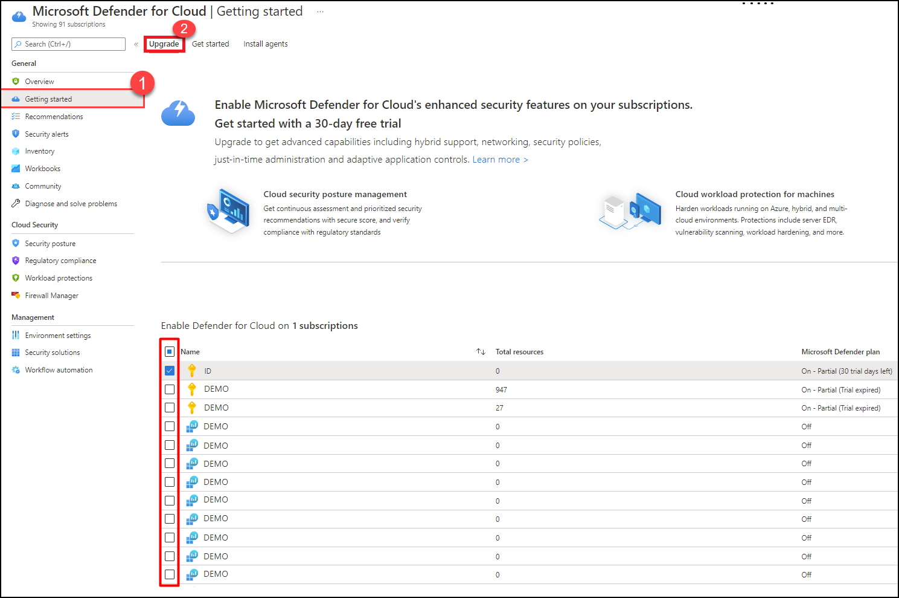
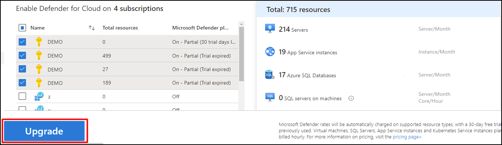
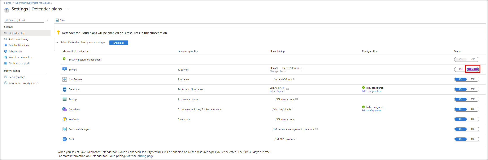
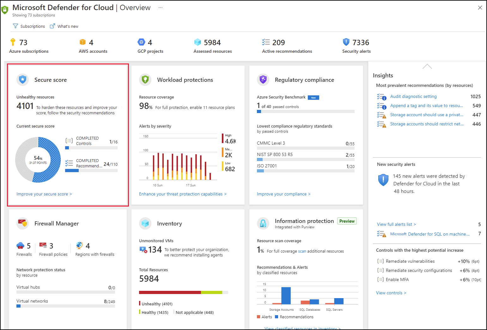
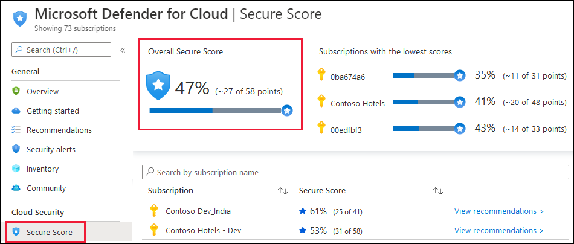
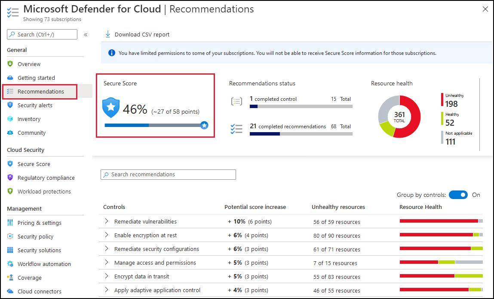
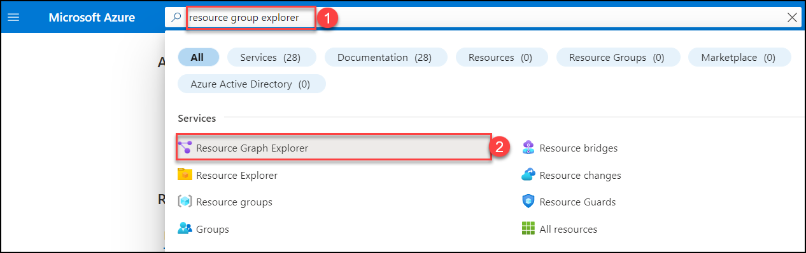
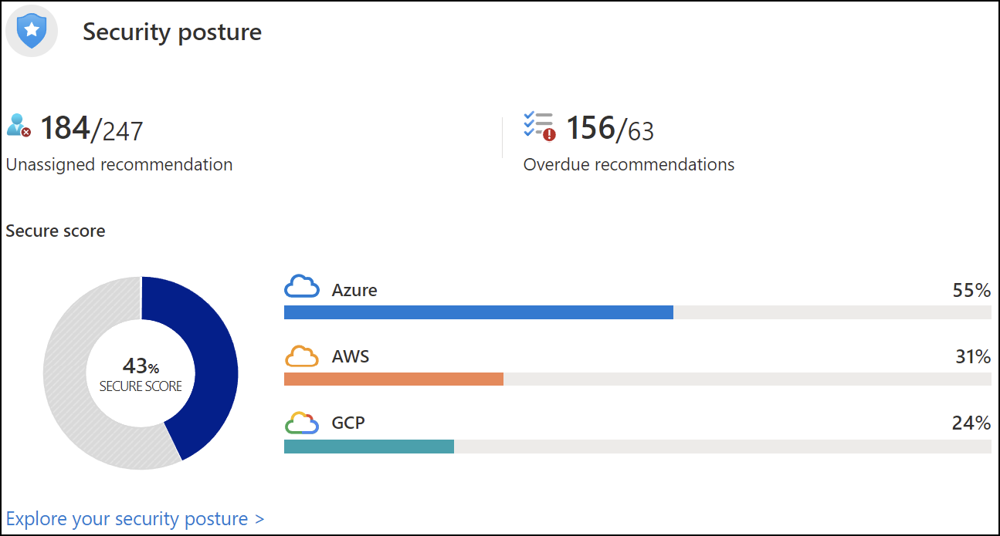
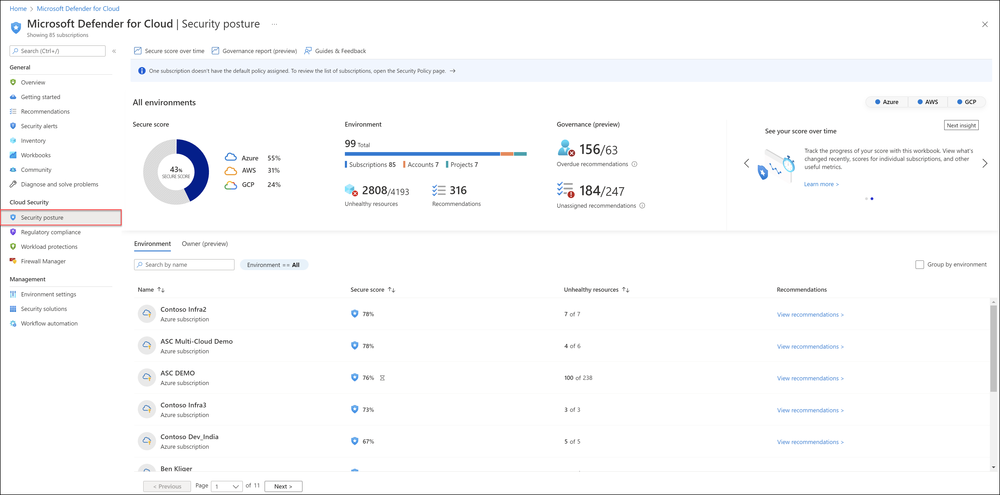
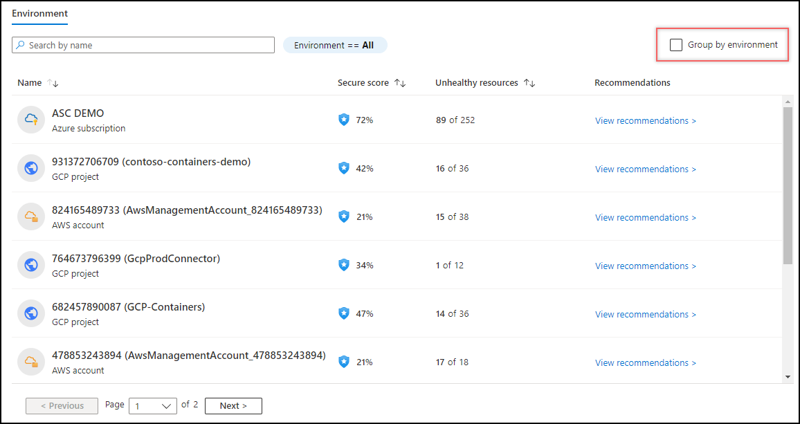

# Azure Security Center/ Microsoft Defender for Cloud
## Lab objectives
In this lab, you will complete the following exercise:
1. Exploring Microsoft Defender for Cloud 
2. Configure Security Policies 
3. Configure Azure inbuild policies definition for Microsoft Defender for cloud. 
4. Secure Score 
5. Improving your Secure Posture 
6. Exploring Security Center and Security benchmark 

# Task 1: Exploring Microsoft Defender for Cloud

### What is Microsoft Defender for Cloud?

Microsoft Defender for Cloud is a Cloud Security Posture Management (CSPM) and Cloud Workload Protection Platform (CWPP) for all of your Azure, on-premises, and multicloud (Amazon AWS and Google GCP) resources. Defender for Cloud fills three vital needs as you manage the security of your resources and workloads in the cloud and on-premises:

- [**Defender for Cloud secure score**](secure-score-security-controls.md) **continually assesses** your security posture so you can track new security opportunities and precisely report on the progress of your security efforts.
- [**Defender for Cloud recommendations**](security-policy-concept.md) **secures** your workloads with step-by-step actions that protect your workloads from known security risks.
- [**Defender for Cloud alerts**](alerts-overview.md) **defends** your workloads in real-time so you can react immediately and prevent security events from developing.

Defender for Cloud secure score continually assesses your security posture so you can track new security opportunities and precisely report on the progress of your security efforts.
Defender for Cloud recommendations secures your workloads with step-by-step actions that protect your workloads from known security risks.
Defender for Cloud alerts defends your workloads in real-time so you can react immediately and prevent security events from developing.

1. In the VM, double click on the **Azure portal shortcut** on the desktop.

    
    
1. Click on the **Environment Details** tab located next to the Lab Guide tab and Copy the **Username and Password**.

    

1. Login to Azure with the username **<inject key="AzureAdUserEmail" />** and click on **Next**.

    

1. Enter password **<inject key="AzureAdUserPassword" />** and click on **Sign in**.

    
    
   > **Note:** If there's a popup entitled **Stay signed in?** with buttons for **No** and **Yes** - Choose **No**.
    
    
        
   > **Note:** If there's another popup entitled **Help us protect your account** click **Skip for now (14 days intil this is required)**

    
           
1. If **Welcome to Microsoft Azure** popup window appears, click **Maybe Later** to skip the tour.

    

1. Search **Microsoft Defender for Cloud(1)** and Select **Microsoft Defender for Cloud(2)**.

    

1. On the Defender for Cloud Page, **Click** on the **Environment settings** under Management

    
    
1. Select the **subscription or workspace** that you want to protect.
    
1. Select **Enable all** to enable all of the plans for Defender for Cloud.

    

1. Select **Save**.

## To enable enhanced security on multiple subscriptions or workspaces:

1. Sign in to the [Azure portal](https://portal.azure.com).

1. Search **Microsoft Defender for Cloud (1)** and then select **Microsoft Defender for Cloud(2)**.

    

1. On the Microsoft Defender for Cloud menu, Click on **Getting started(1)** and then Select **Upgrade(2)**.
   The Upgrade tab lists subscriptions and workspaces eligible for onboarding.
    
    
        
1. Select the desired **subscriptions and workspace** from the list.

1. Select **Upgrade**.

## To Disable enhanced security on multiple subscriptions or worksapces:

1. Sign in to the [Azure portal](https://portal.azure.com).

1. Search **Microsoft Defender for Cloud (1)** and then Select **Microsoft Defender for Cloud(2)**.

    

1. From Defender for Cloud's menu, select **Environment settings**.

    

1. Select the relevant **subscriptions and workspaces**.

1. Find the plan you wish to turn off and select **Off**.

    

# Task 2: Configure Security Policies

## What is a security policy?

- An Azure Policy definition, created in Azure Policy, is a rule about specific security conditions that you want controlled. Built in definitions include things like controlling what type of resources can be deployed or enforcing the use of tags on all resources. You can also create your own custom policy definitions.

- To implement these policy definitions (whether built-in or custom), you'll need to assign them. You can assign any of these policies through the Azure portal, PowerShell, or Azure CLI. Policies can be disabled or enabled from Azure Policy.

- There are different types of policies in Azure Policy. Defender for Cloud mainly uses 'Audit' policies that check specific conditions and configurations then report on compliance. There are also "Enforce' policies that can be used to apply secure settings.

## Task 3: Secure Score 

What is a Secure Score?
As you must have known by now that the azure security center has two goals :
1. It helps you understand your current security situation.
2. It helps you improve your security situation by giving recommendations.
3. A secure score is a way to achieve your goal: the higher the score, the lower the risk level.

To improve the percentage, review Security center recommendations for the pending actions. Proposals also include steps to follow to achieve the goal.

Secure Score
How is the Secure Score Calculated?
Each recommendation has some points assigned to it. If you apply that recommendation, the score will automatically increase. Each proposal will have a maximum score and current score, as shown in the figure.

Score Calculation 
Few formulas are used by azure to calculate the score, which you as a user don’t need to worry about. You need to follow the security recommendations provided by the Azure Security Center.
Overview of secure score
Microsoft Defender for Cloud has two main goals:

to help you understand your current security situation
to help you efficiently and effectively improve your security
The central feature in Defender for Cloud that enables you to achieve those goals is the secure score.

Defender for Cloud continually assesses your cross-cloud resources for security issues. It then aggregates all the findings into a single score so that you can tell, at a glance, your current security situation: the higher the score, the lower the identified risk level.

In the Azure portal pages, the secure score is shown as a percentage value and the underlying values are also clearly presented:

Overview of secure score
Microsoft Defender for Cloud has two main goals:

to help you understand your current security situation
to help you efficiently and effectively improve your security
The central feature in Defender for Cloud that enables you to achieve those goals is the secure score.

Defender for Cloud continually assesses your cross-cloud resources for security issues. It then aggregates all the findings into a single score so that you can tell, at a glance, your current security situation: the higher the score, the lower the identified risk level.

In the Azure portal pages, the secure score is shown as a percentage value and the underlying values are also clearly presented:
## Access and track your secure score
You can find your overall secure score, as well as your score per subscription, through the Azure portal or programmatically as described in the following sections:
Get your secure score from the portal
Defender for Cloud displays your score prominently in the portal: it's the first main tile the Defender for Cloud overview page. Selecting this tile, takes you to the dedicated secure score page, where you'll see the score broken down by subscription. Select a single subscription to see the detailed list of prioritized recommendations and the potential impact that remediating them will have on the subscription's score.

To recap, your secure score is shown in the following locations in Defender for Cloud's portal pages.

In a tile on Defender for Cloud's Overview (main dashboard):

In the dedicated Secure score page you can see the secure score for your subscription and your management groups:

## Get your secure score from Azure Resource Graph

Azure Resource Graph provides instant access to resource information across your cloud environments with robust filtering, grouping, and sorting capabilities. It's a quick and efficient way to query information across Azure subscriptions programmatically or from within the Azure portal.

To access the secure score for multiple subscriptions with Azure Resource Graph:

In the Azure portal, Search **Azure Resource Graph Explorer (1)** and then click **Azure Resource Graph Explorer (2)**.

## Task 4: Improving your Secure Posture 
# Security posture for Microsoft Defender for Cloud
Overview of secure score
## Overview of secure score

Microsoft Defender for Cloud has two main goals:

- To help you understand your current security situation
- To help you efficiently and effectively improve your security

The central feature in Defender for Cloud that enables you to achieve those goals is the **secure score**.

Defender for Cloud continually assesses your cross-cloud resources for security issues. It then aggregates all the findings into a single score so that you can tell, at a glance, your current security situation: the higher the score, the lower the identified risk level.

- In the Azure portal pages, the **secure score** is shown as a percentage value and the underlying values are also clearly presented:
    
    
- In the Azure mobile app, the secure score is shown as a percentage value and you can tap the secure score to see the details that explain the score:
To increase your security, review Defender for Cloud's recommendations page and remediate the recommendation by implementing the remediation instructions for each issue. Recommendations are grouped into **security controls**. Each control is a logical group of related security recommendations, and reflects your vulnerable attack surfaces. Your score only improves when you remediate *all* of the recommendations for a single resource within a control. To see how well your organization is securing each individual attack surface, review the scores for each security control.

For more information, see [How your secure score is calculated](secure-score-security-controls.md#how-your-secure-score-is-calculated) below.
## Manage your security posture

On the **Security posture page**, you're able to see the secure score for your entire subscription, and each environment in your subscription. By default all environments are shown.

| Page section | Description |
|--|--|
|  | Select your environment to see its secure score, and details. Multiple environments can be selected at once. The page will change based on your selection here.|
|  | Shows the total number of subscriptions, accounts and projects that affect your overall score. It also shows how many unhealthy resources and how many recommendations exist in your environments. |

The bottom half of the page allows you to view and manage viewing the individual secure scores, number of unhealthy resources and even view the recommendations for all of your individual subscriptions, accounts, and projects.

You can group this section by environment by selecting the Group by Environment checkbox.

## How your secure score is calculated

The contribution of each security control towards the overall secure score is shown on the recommendations page.

To get all the possible points for a security control, all of your resources must comply with all of the security recommendations within the security control. For example, Defender for Cloud has multiple recommendations regarding how to secure your management ports. You'll need to remediate them all to make a difference to your secure score.

## Task 5: Exploring Security Center and Security benchmark

# Security Center

Azure Security Center by Microsoft is a solution that provides unified security management across hybrid cloud workloads. It offers threat protection for data centers within both cloud workloads and on-premises.

# Implement Security Center

## Task 5.1: In this task, you will on-board and configure Security Center.

1. In the VM, double click on the **Azure portal shortcut** on the desktop.

     

> **Note:**: Sign in to the Azure portal using an account that has the Owner or Contributor role in the Azure subscription you are using for this lab.

2. In the Azure portal, Search **Azure Security Center (1)** and then click **Azure Security Center (2)**. 

     
     
3. On the Security Center | Getting started blade, click **Install agents (1)** and then click **Install agents (2)**.

     

4. On the Security Center | Getting started blade, In the vertical menu on the left side, In the **Management section**, click **Pricing & settings**.

5. On the Security Center | Pricing & settings blade, click the entry representing your subscription and, on the Settings | Azure Defender plans blade, ensure that **Azure Defender on is selected**.

> **Note:**: Review all the features that are available as part of Azure Defender tier and ensure that Azure Defender turned on for each resource type.

6. If you made any changes, click **Save**.

7. On the Settings | Azure Defender plans blade, in the vertical menu bar on the left side, click **Auto Provisioning**.

8. On the Settings | Auto Provisioning blade, make sure that Auto provisioning is set to On for the first item Log Analytics agent for Azure VMs.

9. If needed, on the Settings | Auto Provisioning blade, for the first item Log Analytics agent for Azure VMs click the Edit Configuration link in the Configuration column.

10. On the Extension deployment configuration blade, in the Workspace configuration section, select the Connect Azure VMs to a different workspace option and, in the drop-down list, select the **Log Analytics workspace** you created in the previous lab.

11. On the Extension deployment configuration blade, click Apply, when prompted, select the Existing and new VMs option, click Apply again, and back on the Settings blade, click **Save**.

12. Back on the Settings | Auto provisioning blade, in the vertical menu on the left side, click **Workflow automation**.

13. On the Settings | Workflow automation blade, click **+ Add workflow automation**.

14. On the Add workflow automation blade, review the available settings.

> **Note:**: You can trigger actions based threat detection alerts and Security Center recommendations. You can also configure an action based on Logic apps.

15. On the Add workflow automation blade, click Cancel.

> **Note:**: Security Center provides many insights into virtual machines including system update status, OS security configurations, and endpoint protection.

16. Navigate back to the Security Center | Pricing & settings blade and click the entry representing the Log Analytics workspace you created in the previous lab.

17. On the Settings | Azure Defender plans blade, ensure that Azure Defender on is selected and click **Save**.

## Task 5.2: Review the Security Center recommendation

In this task, you will review the Security Center recommendations.

1. In the **Azure portal**, navigate back to the Security Center | Overview blade.

1. On the Security Center | Overview blade, review the Secure Score tile.

> **Note:**: Record the current score if it is available.

3. Navigate back to the Security Center | Overview blade, select **Assessed resources**.

4. On the **Inventory blade**, select the **myVM entry**.

> **Note:**: You might have to wait a few minutes and refresh the browser page for the entry to appear.

On the Resource health blade, on the Recommendations tab, review the list of recommendations for myVM.

## Task 5.3: Implement the Security Center recommendation to enable Just in time VM Access

In this task, you will implement the Security Center recommendation to enable Just in time VM Access on the virtual machine.

1. In the Azure portal, navigate back to the Security Center | Overview blade and select the **Azure Defender tile**.

1. On the **Azure Defender blade**, click the **Just-in-time** VM access tab, select **Not Configured** and then click the **myVM entry**.

1. Select **Enable JIT** on 1 VM.

1. On the JIT VM access configuration blade, on the far right of the row referencing the port 22, click the **ellipsis button** and then click **Delete**.

1. On the JIT VM access configuration blade, click **Save**.

> **Note:**: Monitor the progress of configuration by clicking on the Notifications icon in the toolbar and viewing the Notifications blade.

> **Note:**: It can take some time for the implementation of recommendations in this lab to be reflected by Secure Score. Periodically check the Secure Score to determine the impact of implementing these features.

**Results**: You have on-boarded Security Center and implemented virtual machine recommendations.

## Azure Security Benchmark

The Azure Security Benchmark (ASB) provides prescriptive best practices and recommendations to help improve the security of workloads, data, and services on Azure

