# Exercise 01: Azure Security Centre/ Microsoft Defender for Cloud
## Lab objectives
In this lab, you will complete the following exercise:
1. Exploring Microsoft Defender for Cloud 
2. Configure Security Policies  
3. Secure Score 
4. Improving your Secure Posture 
5. Exploring Security Centre and Security benchmark 

# Task 1: Exploring Microsoft Defender for Cloud

### What is Microsoft Defender for Cloud?

Microsoft Defender for Cloud is a Cloud Security Posture Management (CSPM) and Cloud Workload Protection Platform (CWPP) for all your Azure, on-premises, and multicoloured (Amazon AWS and Google GCP) resources. Defender for Cloud fills three vital needs as you manage the security of your resources and workloads in the cloud and on-premises:

- Defender for Cloud secure score **Continually Assesses** your security posture so you can track new security opportunities and precisely report on the progress of your security efforts.
- Defender for Cloud recommendations **Secures** your workloads with step-by-step actions that protect your workloads from known security risks.
- Defender for Cloud alerts **Defends** your workloads in real-time so you can react immediately and prevent security events from developing.

Defender for Cloud secure score continually assesses your security posture so you can track new security opportunities and precisely report on the progress of your security efforts.
Defender for Cloud recommendations secures your workloads with step-by-step actions that protect your workloads from known security risks.
Defender for Cloud alerts defends your workloads in real time so you can react immediately and prevent security events from developing.

1. In the VM, double-click on the **Azure portal shortcut** on the desktop.

    
    
1. Click on the **Environment Details** tab located next to the Lab Guide tab and Copy the **Username and Password**.

    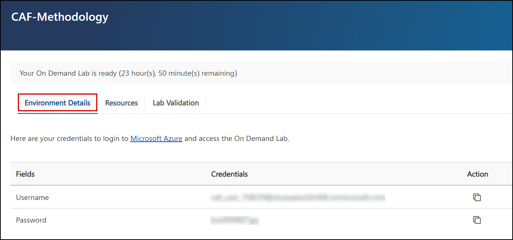

1. Log in to Azure with the username **<inject key="AzureAdUserEmail" />** and click on **Next**.

    

1. Enter a password **<inject key="AzureAdUserPassword" />** and click on **Sign in**.

    
    
   > **Note:** If there's a popup entitled **Stay signed in?** with buttons for **No** and **Yes** - Choose **No**.
    
    
        
   > **Note:** If there's another popup entitled **Help us protect your account** click **Skip for now (14 days until this is required)**

    
           
1. If the **Welcome to Microsoft Azure** popup window appears, click **Maybe Later** to skip the tour.

    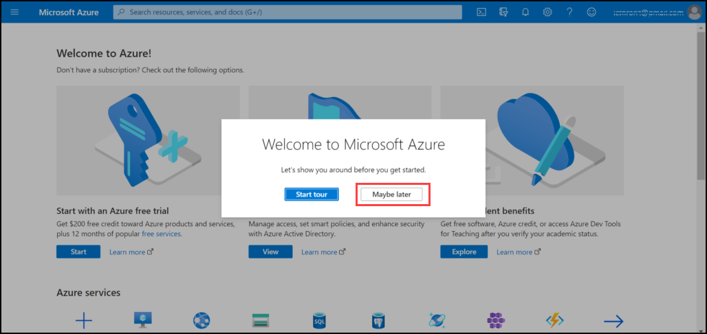

1. Search for **Microsoft Defender for Cloud (1)** in Azure portal search bar and then click on **Microsoft Defender for Cloud (2)**.
    
    

1. On the Microsoft Defender for Cloud, Under Management Click on the **Environment settings**.

    
    
1. Select the **subscription or workspace** that you want to protect.

    
 
1. Select **Enable all** to enable all the plans for Defender for Cloud and then click on  **Save**.

    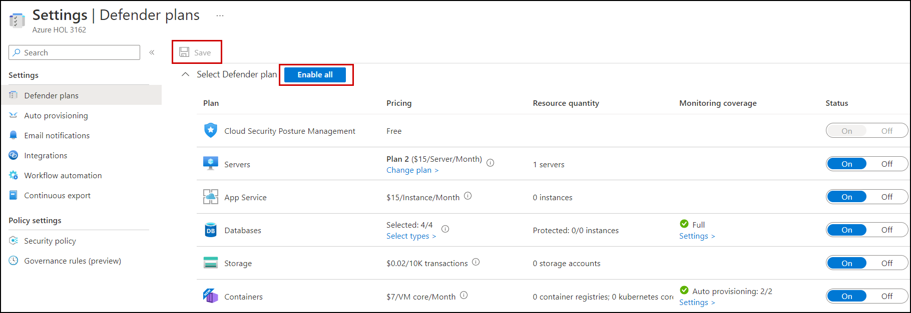
    
1. Back on **Microsoft Defender for Cloud** page under General Click on **Inventory**.

    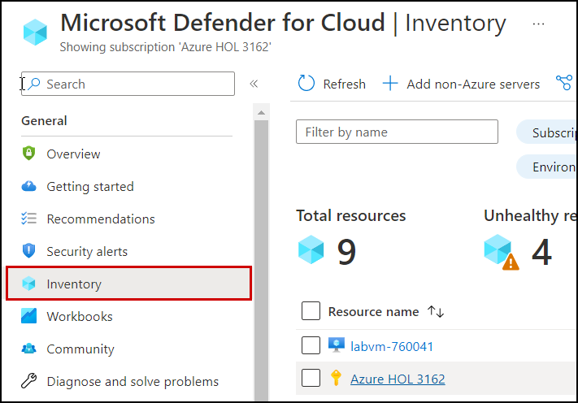
    
1. From the **Inventory** tab, click on the **Add non-Azure servers**.

    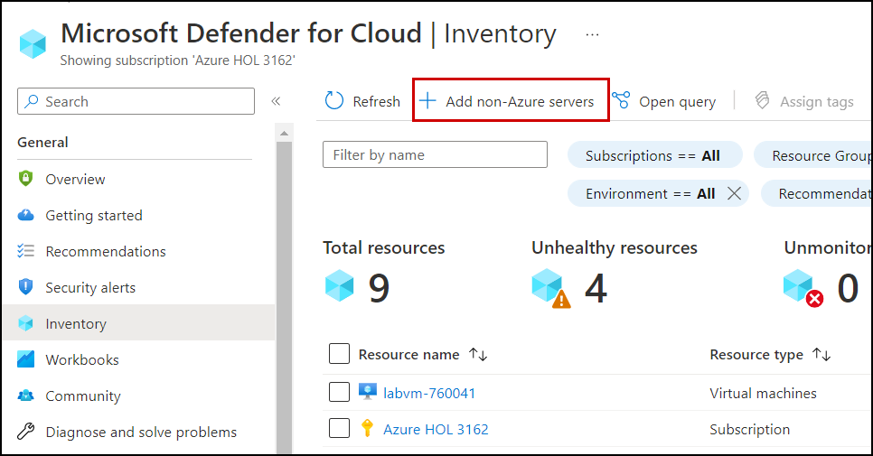
    
1. On **Onboard servers to Defender for Cloud** page, click on **Upgrade** next to the existing **log analytics workspace** named  to upgrade. This will allow Azure Defender protection for your resources.

    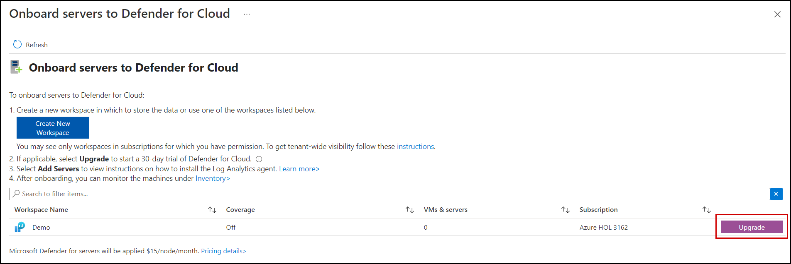
    
1. Once the Defender plans is added you will see another notification which says **Successfully added Defender plans** as shown below.

    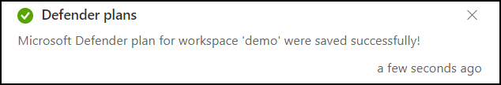
    
1. Now, close the blade and go back to **Inventory** tab and then you will see few connected resources. If you didn't see any resource, you will have to click on Refresh button at the top.

1. You can also find the **Virtual machines** enabled available in the resources list because **LogAnalytics** agent is already enabled for it and the same Log Analytics workspace is connected to Security Center. 

    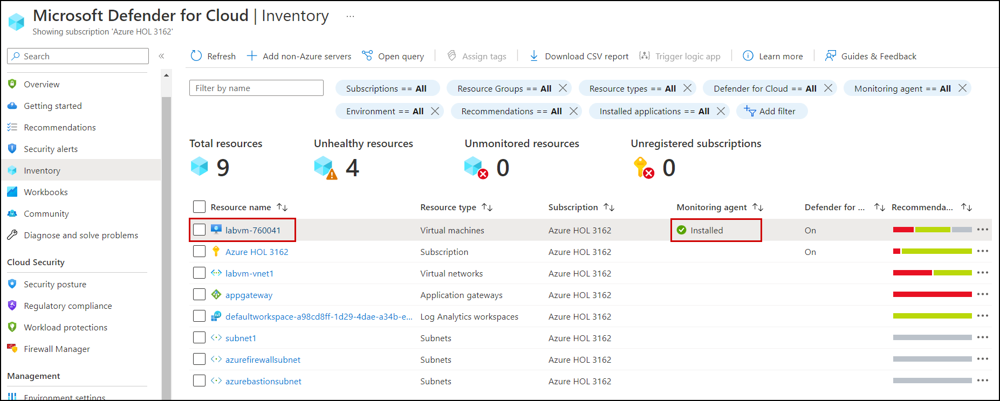

1. On Microsoft Defender for Cloud Under cloud security click on **Security posture**. Here you can get an overview of your security secure, unhealthy resources, and            recommendations.
    
    
   
1. On Microsoft Defender for Cloud Under cloud security click on **Regulatory compliance**. you can get insights into your compliance posture based on continuous            assessment of both Azure and hybrid cloud environments. This tile shows the following standards which are **Azure Security Benchmark** and **Lowest compliance          regulatory standards**.

    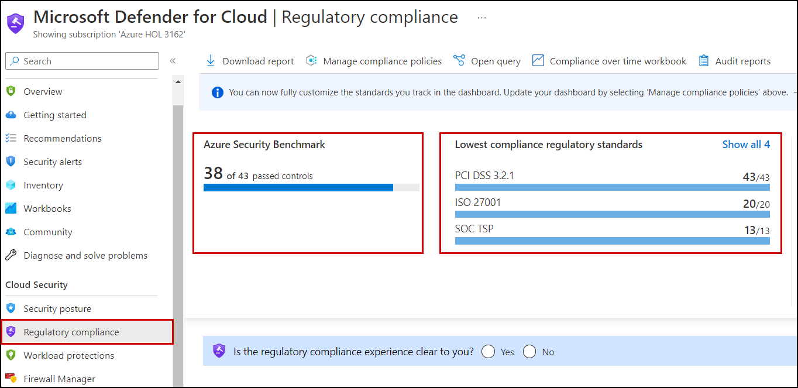
    
1. On Microsoft Defender for Cloud Under cloud security click on **Workload protections**. you can see the coverage of your **connected resources** for the currently selected subscription. Additionally, you can also view the recent **security alerts**, color-coded by severity.

    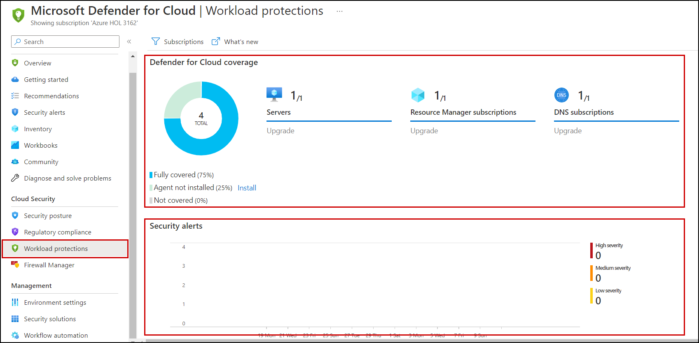
    
    
# Task 2: Configure Security Policies

### What is a security policy?

- An Azure Policy definition, created in Azure Policy, is a rule about specific security conditions that you want to be controlled. Built-in definitions include things like controlling what type of resources can be deployed or enforcing the use of tags on all resources. You can also create your own custom policy definitions.

- To implement these policy definitions (whether built-in or custom), you'll need to assign them. You can assign any of these policies through the Azure portal, PowerShell, or Azure CLI. Policies can be disabled or enabled from Azure Policy.

- There are different types of policies in Azure Policy. Defender for Cloud mainly uses 'Audit' policies that check specific conditions and configurations and then report on compliance. There are also "Enforce' policies that can be used to apply security settings.

## Explore Cloud Policy

1. From Defender for Cloud's menu, select **Environment settings**. Here you'll be able see the subscription.

    
    
1. Select the relevant **subscriptions and workspaces**.

    

1. On the left-hand side Blade under Policy settings, click on **Security policy (1)** and then click on **Assign policy (2)**.
    
    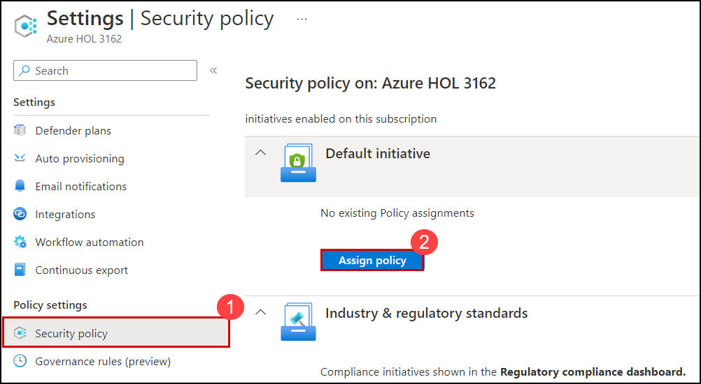

1. On the Azure Security Benchmark page, Click on **Non-compliance messages (1)** and then select all **Policy definations (2)**, then click on **Review + create          (3)**.

    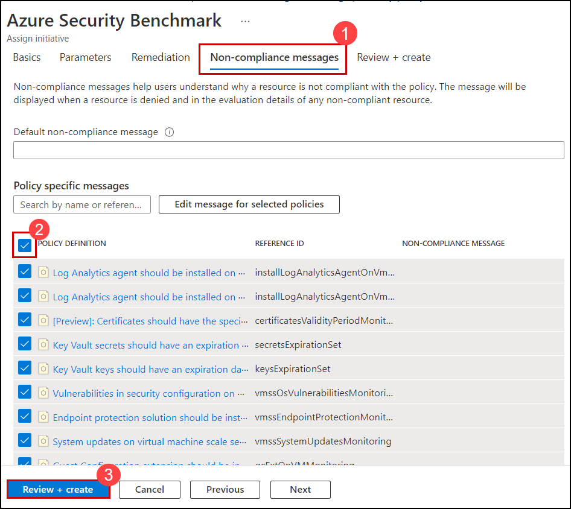

1. Now click on **Create**.

    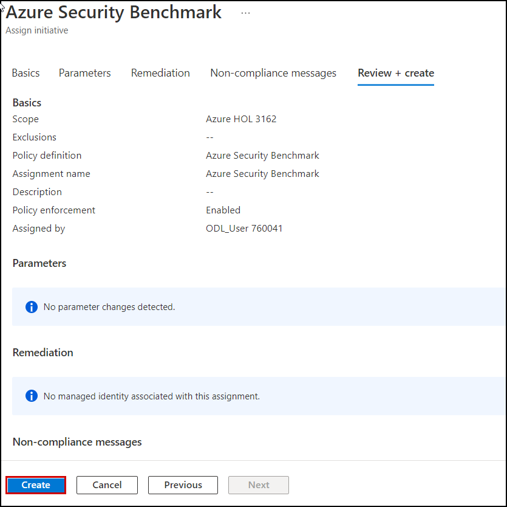

1. Under the Security policy you can also find **Industry & regulatory standards**, which can be configured with ASC default initiative.

    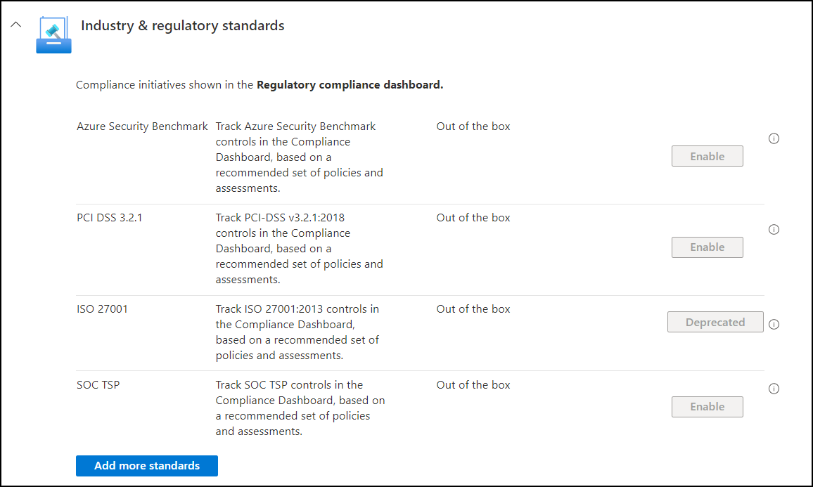

1. Wait for a couple of minutes and then **Refresh** the browser page to see the Industry & regulatory standards enabled.

    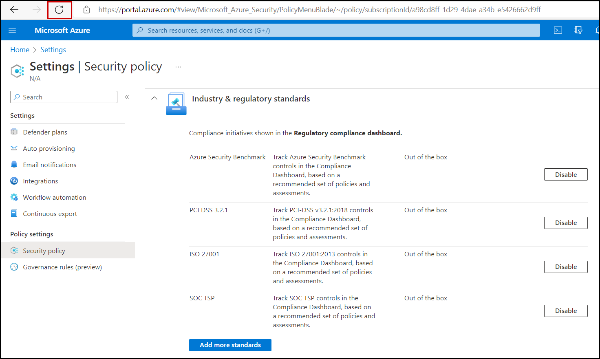
    
## Explore Azure Policy

1. Search for **Policy (1)** in Azure portal search bar and then click on **Policy (2)**.

    
    
1. From the left navigation pane, under the **Authoring** section, click on **Definitions(1)**. This is where you can explore the built-in policy definitions and          initiatives.
1. From the top menu use the filter ribbon, set the Definitions Type as **Initiative(2)** and select **Security Center(3)** from the Category filter.

    
    
1. You can now see built-in initiatives used by Microsoft Defender for Cloud. You can choose one of them. Below is an example.

    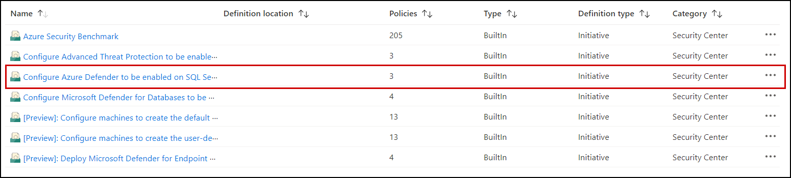
  
1. On the Configure Azure Defender to be enabled on SQL Servers and SQL Managed Instances page click on **Assign**.

    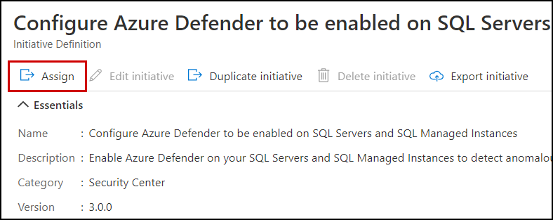

1. On the **Basics** tab. Click on **Scope[...] (1)** and then select **Subscription (2)** and **Resource Group (3)**, then click on **Save (4)**.

    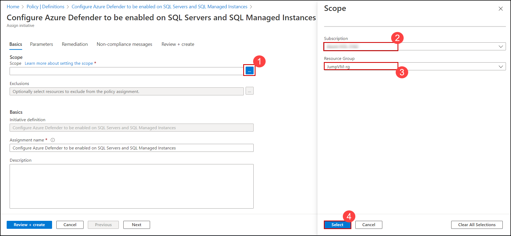
    
1. Click on **Non-compliance messages (1)** and then select all **Policy definations (2)**, then click on **Review + create (3)**.

    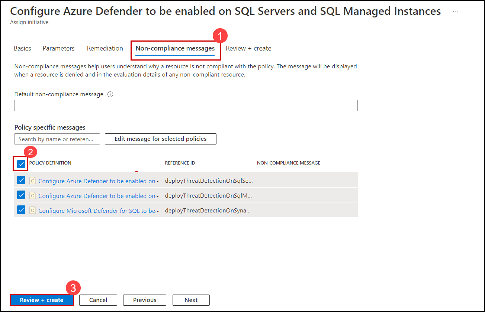
    
1. Now click on **Create**.

    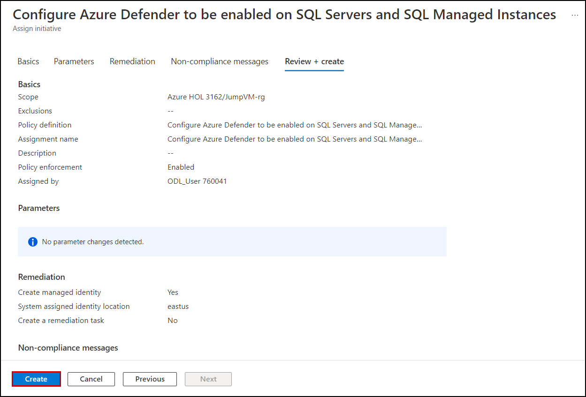

1. Once the Policy is assigned you will see another notification which says **Role Assignments creation succeeded** and **Creating initiative assignment succeeded** as    shown below.

    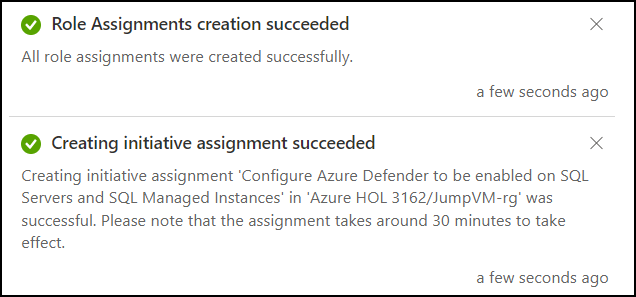
    
1. To see current assignments, click on **Assignments** from the left navigation pane under **Authoring**. Policy initiatives have a different name for the                assignments, for example:

    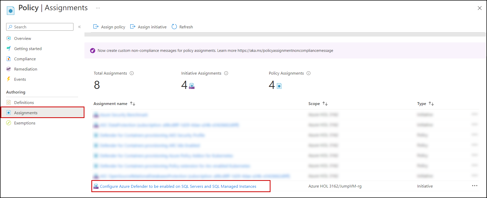

# Task 3: Secure Score 

### What is a Secure Score?
- It helps you understand your current security situation.
- It helps you improve your security situation by giving recommendations.
- A secure score is a way to achieve your goal: the higher the score, the lower the risk level.

### Access and track your secure score

1. Search **Microsoft Defender for Cloud (1)** and Select **Microsoft Defender for Cloud (2)**.

    

1. On the Microsoft Defender for Cloud overview page, you can see your **secure score**.

    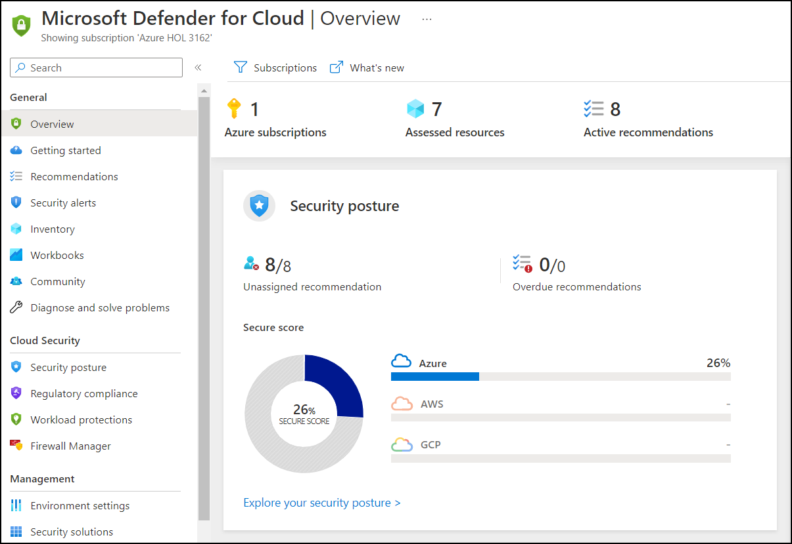

1. Click on **Security Posture**.

    

1. Here you can get an overview of your security secure, unhealthy resources, and recommendations.

    

# Task 4: Improving your Secure Posture 

1. Search **Microsoft Defender for Cloud (1)** and Select **Microsoft Defender for Cloud (2)**.

    
    
1. On the Microsoft Defender for Cloud menu under General click on **Recommendations. (1)** and then click on **All Recommendations (2)**.

    

1. Click on those names that have **unassigned** status below is an example.

    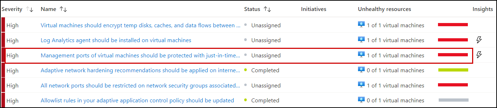
    
1. Under Affected resources select your **virtual machine (1)** and then click on a **fix (2)**.

    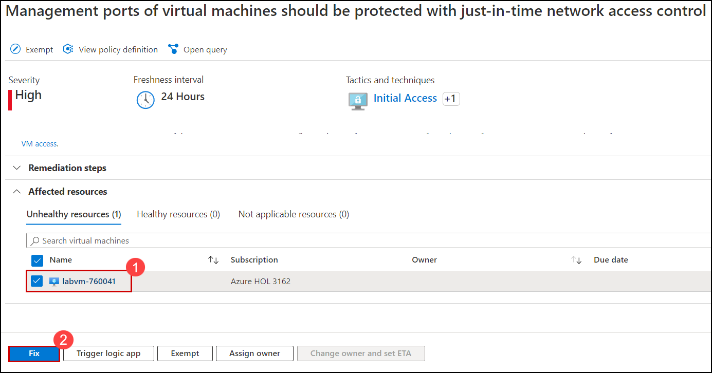

1. On the JIT VM access configuration menu click on **Save**.

    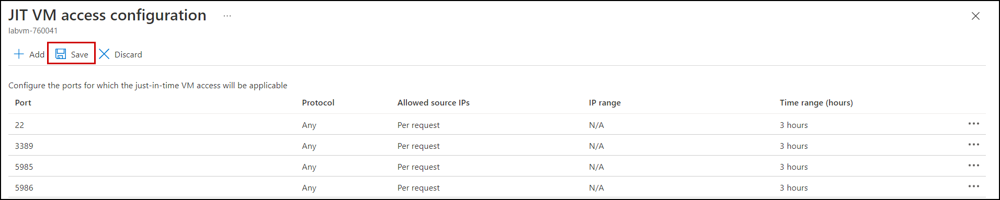

# Task 5: Exploring Security Centre and Security benchmark

Azure Security Center by Microsoft is a solution that provides unified security management across hybrid cloud workloads. It offers threat protection for data centres within both cloud workloads and on-premises.

1. In the Azure portal, Search **Azure Security Centre (1)** and then click **Azure Security Centre (2)**. 

    
     
1. On the Security Centre | Getting started blade, click **Install agents (1)** and then click **Install agents (2)**.

    

1. On the Security Centre | Overview blade, review the **Secure Score**.

    
    

    
    
1. Click on the **Next** button present in the bottom-right corner of this lab guide. 

