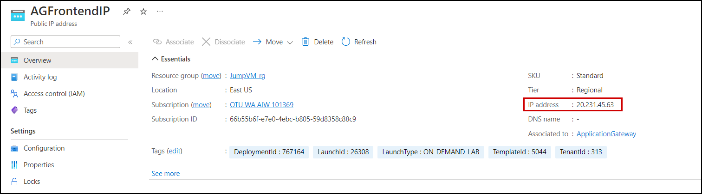

# Exercise 2: Azure Web Application Firewall on Application Gateway

### Overview

Azure Firewall is a managed, cloud-based network security service that protects your Azure Virtual Network resources. It's a fully stateful firewall as a service with built-in high availability and unrestricted cloud scalability. To learn more about Azure Firewall refer: `https://docs.microsoft.com/en-us/azure/firewall`

Azure Application Gateway is a web traffic load balancer that enables you to manage traffic to your web applications. Traditional load balancers operate at the transport layer (OSI layer 4 - TCP and UDP). To learn more about Application gateway refer: `https://docs.microsoft.com/en-us/azure/application-gateway`

In this exercise, you will deploy an Azure Firewall and Application Gateway with WAF V2 then you will publish an application through it. You'll also test the application for security and perform a sample attack.

This exercise includes the following tasks:

  - Configure WAF to Protect your web application
  - Publish your application to the internet with the application gateway
  - Monitor attacks against your web application
  - Customize WAF rules
  - Attack simulation

 # Task 1: Configure WAF to Protect your web application
 
 In this task, you will add Virtual Machine as the Backend pool of Application gateway and also configure the Application Gateway from irewall policy.
 
 1. From the Azure **Home** page, search for **Application gateways (1)** from the search bar and select **Application gateways (2)**.
 
      
    
 1. Select your **Application Gateway**.

      
      
 1. On the Application gateway blade click on the **Backend pools(1)** under setting and then select **AGBackendtarget(2)**.

     
     
 1. On the **Edit backend pool** page, follow the below-mentioned instructions:

    - **Target type** : Select **Virtual Machine (1)** from drop-down.
    - **Target** : Select **JumpVM-<inject key="Deployment ID" enableCopy="false"/>-nic (2)** from drop-down
    - Click on **Save (3)**

    
    
1. Once the Backend pools are edited, you will see the notification that says **Successfully added rule collection**, as shown below.

     

 1. Navigate back to the home page and search for **Application Firewall Policies (1)** from the search bar and select **Web Application Firewall Policies (2)**.

      
 
 1. Click on **firewallpolicy** under the Web Application Firewall page and click on **Associated application gateways** under the **Settings** tab from the Application Gateway WAF policy page.

     
     
 1. On the **Associated Application gateway** page, click on **+ Add association (1)** and select **Application Gateway(2)**

    
    
 1. Under the **Associate an application gateway** page, follow the below instructions:

    - **Application Gateway (WAF v2 SKU)** : Select **Aplication Gateway (1)** from drop-down 
    - **Check** the box next to **Apply the web Application Firewall policy configuration even if it's different from the current configuration (2)**
    - Click on **Add (3)**

    
    
    
1. Navigate back to the **Associated Application gateway** page, click on **+ Add association (1)**, and select **HTTP Listener (2)**

    
 
1. Under, the **Associate listeners in an application gateway** page, follow the below instructions:

    - **Application Gateway (WAF v2 SKU)** : Select **Application Gateway (1)** from drop-down .
    - **Listeners** : Select **AGListener (2)**.
    - Click on **Add (3)**

     
          
1.  Monitor the deployment status by selecting the **Notifications Bell (1)** icon at the top of the portal. In a minute or so, you should see a confirmation stating that **Updated the Application Gateway**.

     
    
 # Task 2: Publish your application to the internet with the application gateway
 
In this task, you'll publish an application via Application Gateway by configuring the DNAT rules from firewall policy.

1.  In the the Azure **Home** page, from the search bar search for **Application gateways (1)** and then select **Application gateways (2)**.
 
     
 
1. Select your **Application Gateway**.
 
     
 
1. Select the **Frontend public IP address** of the application gateway.
 
      

1.  Copy the **Public Ip address** and save it to notepad for later use.

     
    
1. On the Azure Portal **Home** page, search **Azure Firewall (1)** and then select **Firewalls (2)**.

   
    
1. Click on the **AzureFirewall**.

   
   
1. Select **Firewall Public IP** from the Overview tab.

    
    
1. Copy the **Public Ip address** and save it to notepad for later use.

      
     
1. Navigate back on Azure Firewall, Select **Firewall Manager (1)** from the **Settings** tab and click on **Visit Azure Firewall Manager to configure and manage this firewall (2)**

   
    
1. Select **Azure Firewall Policies (1)** under **Firewall Manager** page and click on Firewall Policy **firewallpolicy (2)**.

   
   
1. Select **DNAT Rules (1)** from **Settings** tab under **Firewall Policy** page and select **+ Add a rule collection (2)**

   
    
1. Under the **Add a rule collection** page, enter the below details:

    - Name: **afw-contoso-prod-firewall-rulecolection (1)**
    - Rule Collection type: **DNAT (2)**
    - Priority: **100 (3)**
    - Rule collection group: **DefaultDnatRuleCollectionGroup (4)**
    - Under **Rules (5)** mention the below details:
      - Name: **afw-dnat-http**
      - Source type: Select **IP Address** from the drop-down list
      - Source: Enter *
      - Protocol: Select **TCP** from the drop-down list
      - Destination Ports: **80**
      - Destination type: Select **IP Address** from the drop-down list
      - Destination: Enter the IP address of **Firewall** which you copied in step 8.
      - Translated address: Enter the Public IP address of **Application gateway** which you copied in step 4.
      - Translated port: **80**
     
     - Click on **Add (6)**

       
          
1. Now, to test the application copy and paste the Frontend public IP address of **Application Gateway** in a new browser tab which you copiend in step 4.

   
       
  > **Note**: This will confirm that you have published the Contoso web application via Application Gateway.
  
### Task 3: Monitor attacks against your web application 

In this task, you will Monitor the attacks against the web application using Network Watcher.

### Task 3.1: Create Storage Account

In this task, you will create a storage account, this storage account will be used to store the NSG flow logs
     
1. Now from the **Home** page of Azure Portal, type **Storage account (1)** on the search box and then click on it. 

   
     
1. In the **Storage account** page, select **Create**.

   
     
1.  On the **Basics** tab of the **Storage account** blade, enter the below details:

     - Subscription : **Leave it as default (1)**.

     - Resource group : **JumpVM-rg (2)**

     - Storage account name : Enter **stacc<inject key="Deployment ID" enableCopy="false"/> (3)**

     - Region : Enter **<inject key="Region" /> (4)**

     - Performance: Select **Standard**

     - Redundancy : Select **Geo-redundant storage (GRS) (5)**
     
     - Click on **Next (6)**

       
       
 1. Now under **Advanced** tab, leave everything to default and then click on **Next**.

     

 
 1. Now under **Networking** tab, leave everything to default and then click on **Next**.

     

1. Now under **Data protection** tab, leave everything to default and then click on **Next**.

     

1. Now under **Encryption** tab, leave everything to default and then click on **Next**.

     

1. Now under **Tags** tab, leave everything to default and then click on **Next**.

     
         
1.  Review the configuration of the storage account and click on **Create**.

     
      
      

 ### Task 3.2: Create NSG flow logs.
 
 In this task, you will create NSG flow logs in the Network Watcher.

1. Now navigate back to the Azure **Home** page, from the search bar search for **Network Watcher** and select it.

   
   
1. On the Network Watcher page, select the **NSG flow logs** under Logs.

   
    
      
1. Now click on **Create NSG flow log**.
  
    
      
1. On the **Basics** tab of **Create a flow log**, enter the following details:

      - Under **Project details** click on **+ Select NSG**.

         
         
      - On **Select network security group** page, select **JumpVM-<inject key="Deployment ID" enableCopy="false"/>-nsg (1)** and click on **Confirm selection (2)**.

        
        
      - Under **Instance details**, follow the below steps:

         - Storage Accounts :Select **stacc<inject key="Deployment ID" enableCopy="false"/> (1)**

         - Retention(days) : Enter **7 (2)**

         - Select **Configuration (3)**

           
        
1. Under the **Configuration** tab, check the box to **Enable Traffic Analytics (1)** and select **Review + Create (2)**.

     
        
1. Review the configuration of the flow log and select **Create**.

   
       
1. You'll be able to see the created NSG flow logs for both virtual machines under **NSG Flow logs** of **Network watcher blade**

    
    
    
### Task 3.3: Run Sample traffic and perform traffic analytics, review logs

 In this task, you will enable the Traffic Analytics in the NSG flow logs and review the logs.
 
1. Navigate back to the Azure **Home** page, from the search bar search for **Application gateways (1)** and then select **Application gateways (2)**.
 
     
 
 1. Select your **Application Gateway**.
 
     
 
 1. Copy the **Frontend public IP address** of the application gateway.
 
      

 1. To test the application copy and paste the Frontend public IP address of **Application Gateway** in a new browser tab and generate some traffic by refreshing the browser.
 
      > **Note**: You will see that your website is running.
 
      

1. Navigate to the resource group **JumpVM-rg**, and from the **Overview (1)** tab select the Firewall.

   
   
1. Select **Firewall Public IP** from the Overview tab.

    
    
1. Copy the Public Ip and save it in a text editor.

    
      
1. Navigate to the Firewall's public IP address and generate some traffic by refreshing the browser.

   

1. Navigate back to the Network Watcher and select **Traffic Analytics**, under **Logs** from the options on the left side of the Network Watcher blade.

   
      
1. On the **Traffic Analytics** page, set the time interval to **Last 30 minutes**.

   
   
   > **Note**: If you observe the **Time interval** is greyed out, click on **Meanwhile, click here to see just resource data** and perform the above step.

      
      
1. Now, you can observe the total number of network traffic flows from **Traffic Visualization**

    > **Note**: The dashboard may take up to 30 minutes to appear when deployed for the first time. This is because Traffic Analytics must first aggregate enough data for it to derive meaningful insights. If it takes more time, you can perform the next task and can come back later and check on this
      
      
     
1. Under **Traffic Analytics** Scroll down to **Your Environment** to view the total number of **Deployed Azure regions (1)**, **TA Enabled NSGs (2)**, **Virtual networks (3)**, and **Virtual subnetworks (4)**.

    
      
1. To visualize the traffic distribution by geography, click on **View map**. The geo-map shows the traffic distribution to a data center from countries/regions and continents communicating with it.

    
     
1. In the **Traffic Analytics Geo Map View** page, click on the **Green** icon which indicates the Azure region, and observe the resources deployed under the region, to explore more select **More details**.

    
      
1. Under the **More Insights** blade, scroll down and explore traffic distribution for deployments of the East US region.

    
     
1. To close the **Traffic Analytics Geo Map View**, click on the cross at the top right corner.

     
      
1. Close the **Ports receiving traffic from Internet** page by clicking the **Cross (X) icon** from the top right corner.
      
1. Under the Traffic Analytics page, scroll down to **Traffic Distribution** to view the analytics of traffic flows across the host, subnet, VNet, and VMSS.

    
     
1. To view the analytics of traffic flows across the host, select **IP (1)**, then select **See all (2)** from **Traffic Distribution**.

    
    
1. You can observe the graph of **Time trending chart for top 5 talking IPs** from the **Traffic distribution across top IPs** page.

    
    
1. Under **Details of top 5 talking IPs**, select VM IP to explore more about traffic distribution.

     
     
1. Close the **Traffic distribution across top IPs** by clicking the **cross (X) icon** at the top-left corner of the page.
    
1. In the same way, you can explore more about **Malicious traffic**, and **Blocked traffic** 

1. Now scroll down to **Application ports**, to view analytics for application ports utilized across your environment and select **See all**.

    
     
1. From the **Most frequent L7 protocols** page, you can explore more about the ports and their ranging.

    
     
     
### Task 4: Customize WAF rules
 
 In this task, you will configure the Custom rules for firewall policy and will publish the web application within the VM and from Local computer to check the application reachability.
 
 1. Within the **Jump VM**, type **cmd (1)** in the search bar and right-click on **Command Prompt (2)** then click on **Run as administrator (3)**.
 
      
 
 1. On the Command Prompt, type **ipconfig (1)** and then copy the **IPv4 Address (2)** and save it to notepad for later use.
 
      
 
 1. In the Azure portal, search **WAF (1)** and then select **Web Application Firewall policies (WAF) (2)**.
 
      
 
 1. On the WAF page, select your **firewallpolicy (1)**, and under settings, click on **Custom rules (2)** and after that click on **+ Add custom rule (3)**.
 
      
 
 1. On the **Add custom rule** blade, enter the following details
 
    - Custom rule name : **WAFcustomrule (1)**.
    - Priority : enter **1 (2)**.
    - IP address or range: Enter **IPv4 Address (3)** that is copied above in step 2
    - Click on **Add (4)**.
 
      
 
 1. Click on **Save**.
 
      

  1. Once the custom rule is created you will see the notification that says **Successfully updated the WAF policy**, as shown below.
 
      
 
 1.  Now, open a new tab in the Jump VM and browse the **IPv4 Address**.
 
     > **Note**: you will see that your website is Running.

 
      
 
 1. Now, you can paste the **IPv4 Address** in your **Local computer / Personal computer**. You can  observe the **This site can’t be reached error**
 
      > **Note**: You will see that your website is Blocked outside the Jump VM
 
     

 ### Task 5: Attack simulation 
     
In this task, you will be testing your application for security and performing sample attacks like XSS. Cross-Site Scripting (XSS) attacks are a type of injection, in which malicious scripts are injected into otherwise benign and trusted websites. XSS attacks occur when an attacker uses a web application to send malicious code, generally in the form of a browser-side script, to a different end-user.

   > **Note**: You can perform this task only after finishing task 2 and task 3.

1. You can perform a sample attack on your application by passing this `?q=<script>` value at the end of the web application URL or IP address.
    
1. Now pass the value `?q=<script>` at the end of your **Application Gateway** IP and try browsing it. You can observe the web application can be still accessible.
  
   > **Note** : Your browsing URL value should look ```http://20.185.224.102/?q=<script>```
    
   
  
1. To make your application more secure, select **ApplicationGateway** from the overview page of the resource group.
     
   
    
1. Under the **Application gateway** page, follow the below details:
     - Select **Web application firewall (1)** under **Settings**    
     - Click on **firewallpolicy** under **Associated web application firewall policy (2)**   
  
     
 
1. Under the **firewallpolicy** page, go to the **Overview (1)** tab and click on **Switch to prevention mode (2)**.
 
    
    
1. Now, navigate back to the tab where you browsed the IP Address and refresh the page. You can observe the **403 Forbidden error**.
    
    
 
     
## Summary
 
In this exercise you have covered the following:
  
   - Configured WAF to Protect your web application 
   - Published an application to the internet with the application gateway 
   - Monitored attacks against your web application 
   - Customized WAF rules
   - Performed Attack simulation

Click on the **Next** button present in the bottom-right corner of the lab guide to start with the next exercise of the lab.
