# Exercise 2: Azure Web Application Firewall on Application Gateway
## Lab objectives
In this lab, you will complete the following exercise:

1. Configure WAF to Protect your web application
2. Publish your application to the internet with the application gateway
3. Monitor attacks against your web application
4. Customize WAF rules
5. Attack simulation

### What is Azure Web Application Firewall ?
Microsoft Azure also has a WAF service that provides centralized protection of your web applications from common exploits and vulnerabilities. The Azure Web Application Firewall is one of the features of Azure Application Gateway (layer 7 load balancer) and its main goal is to protect a web application to common attack like SQL injections, cross-site scripting and others. Also it is following the Open Web Application Security Project (OWASP) Core Rule Set. Azure WAF service offers you to select some or all of the rules from the OWASP Core Rule Set.

Azure Application Gateway has a public IP, or front end, and your application users will use this IP address to connect to your application gateway. Application Gateway is going to take the incoming traffic and, based on a few rules, redirect the traffic to the appropriate back end in the backend pool. You can have app services, virtual machines, virtual machine scale sets, or even other IP addresses in the backend pools.

 
 
 ## Task 1: Configure WAF to Protect your web application
 
 1. Search **Application Gateway (1)** and then select **Application Gateway (2)**.
 
      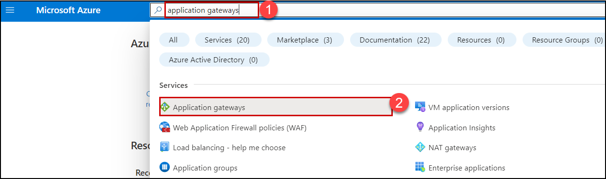
    
 1. Select your **Application Gateway**.

      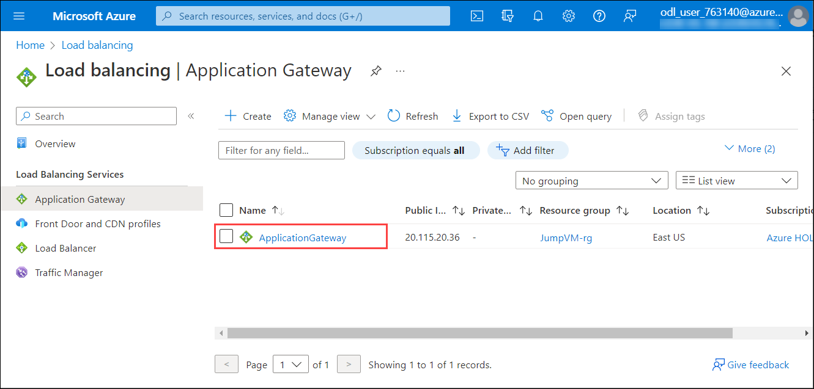
      
 1. On the Application gateway blade click on **Backend pools(1)** setting and then select on **AGBackendtarget(2)**.

     
     
 1. On **Edit backend pool** page, follow the below mentioned instructions:

    - **Target type** : Select **Virtual Machine (1)** from drop-down.
    - **Target** : Select **JumpVM-<inject key="Deployment ID" enableCopy="false"/>-nic (2)** from drop-down
    - Click on **Save (3)**

    
    
1. Once the Backend pools is edited, you will see the notification that says **Successfully added rule collection**, as shown below.

     

 1. Navigate back to home page and search for **Application Firewall Policies (1)** from search bar and select it **(2)**.

      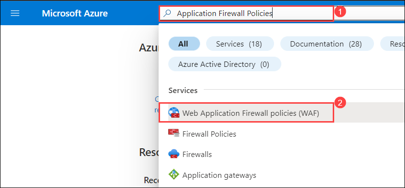
 
 1. Click on **firewallpolicy** under Web Application Firewall page and click on **Associated Application gateways** under Settings from Application Gateway WAF policy page.

     
     
 1. Under **Associated Application gateway** page, click on **+ Add association (1)** and select **Application Gateway(2)**

    
    
 1. Under **Associate an application gateway** page, enter below instructions:

    - **Application Gateway (WAF v2 SKU)** : Select **Aplication Gateway (1)** from drop-down 
    - **Check** the box next to **Apply the web Application Firewall policy configuration even it's different from current configuation (2) **
    - Click on **Add (3)**

    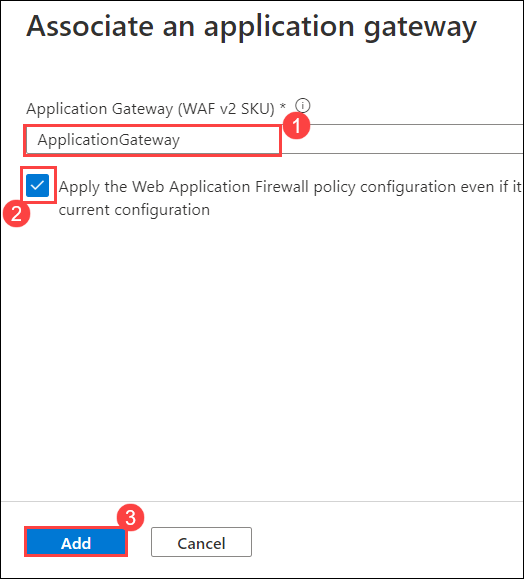
    
    
1. Back on, under **Associated Application gateway** page, click on **+ Add association (1)** and select **HTTP Listener (2)**

    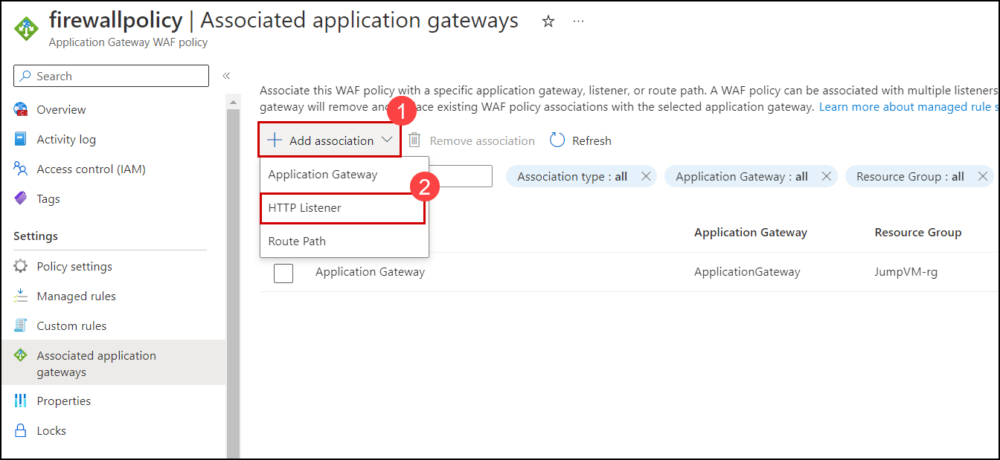
 
1. Under, **Associate listeners in an application gateway** page, enter below instructions:

    - **Application Gateway (WAF v2 SKU)** : Select **Aplication Gateway (1)** from drop-down .
    - **Listeners** : Select **AGListener (2)**.
    - Click on **Add (3)**

     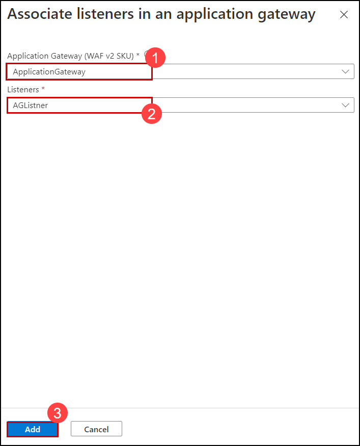
          
1.  Monitor the deployment status by selecting the **Notifications Bell (1)** icon at the top of the portal. In a minute or so, you should see a confirmation of the successful deployment.

     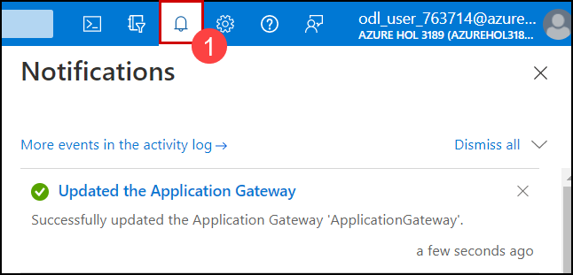
    
 ## Task 2: Publish your application to the internet with the application gateway
 
In this task, you'll publish an application via Application Gateway.

1. On the Azure Portal **Home** page, search **Azure Firewall (1)** and then select **Firewalls (2)**.

   
    
1. Click on the firewall **AzureFirewall**.

   
     
1. Select **Firewall Manager (1)** from **Settings** and click on **Visit Azure Firewall Manager to configure and manage this firewall (2)**

   
    
1. Select **Azure Firewall Policies (1)** under **Firewall Manager** page and click on Firewall Policy **firewallpolicy (2)**.

   
   
1. Select **DNAT Rules (1)** from **Settings** tab under **Firewall Policy** page and select **+ Add a rule collection (2)**

   
    
1. Under **Add a rule collection** page, enter the below details:

    - Name: **afw-contoso-prod-firewall-rulecolection (1)**
    - Rule Collection type: **DNAT (2)**
    - Priority: **100 (3)**
    - Rule collection group: **DefaultDnatRuleCollectionGroup (4)**
    - Under **Rules (5)** mention the below details:
      - Name: **afw-dnat-http**
      - Source type: Select **IP Address** from the drop-down list
      - Source: Enter *
      - Protocol: Select **TCP** from the drop-down list
      - Destination Ports: **80**
      - Destination type: Select **IP Address** from the drop-down list
      - Destination : Enter the IP address of **Firewall** 
      - Translated address: Enter the Public IP address of **Application gateway**. 
      - Translated port: **80**
     
     - Click on **Add (6)**

       
          
1. Now, to test the application copy and paste the Frontend public IP address of **Application Gateway** in a new browser tab.

   
       
  > **Note** : This will confirm that you have published the Contoso web application via Application Gateway.
  
## Task 3: Monitor attacks against your web application 

### Task 3.1: Create Storage Account

In this task, you will create a storage account, this storage account will be used to store the NSG flow logs
     
1. Now from the **Home** page of Azure Portal, type **Storage account (1)** on the search box and then click on it. 

   
     
1. In the **Storage account** page, select **Create**.

   
     
1.  On the **Basics** tab of **Storage account** blade, enter the below details:

     - Subscription : Select your **Subscription (1)**

     - Resource Group : Select **JumpVM-rg (2)**

     - Storage account name : Enter **stacc<inject key="Deployment ID" enableCopy="false"/> (3)**

     -  Performace : Select **Standard (4)**

     - Redundancy : Select **Geo-redundant storage (GRS) (5)**
     
     - Select **Review (4)**

       
         
 1.  Review the configuration of the storage account and click on **Create**.

      
      
 1. Once the deployment is completed, click on **Go to resource**.

     
      
 ### Task 3.2: Create Log Analytics Workspace
 
 In this task, you will create Log Analytics Workspace. This Log Analytics workspace will be used by Traffic Analytics to store the aggregated and indexed data that is then used to generate the analytics.
      
 1. From the **Home** page of Azure Portal, type **Log Analytics Workspace** on the search box and then click on it. 

    
    
 1. Select **Create**.

     
      
 1.  On the **Basics** tab of **Create Log Analytics workspace**, enter the below information:
       
       - Subscription : Select your **Subscription (1)**

       - Resource Group : **<inject key="Resource Group" enableCopy="false"/> (2)**

       - Name : **log-contoso-diagnosticworkspace (3)**

       - Region : **East US (4)**

       - Select **Review + Create (5)**

       
       
 1. Review the configuration of analytics workspace and select **Create**

    
       
 ### Task 3.3: Create NSG flow logs.
 
 In this task, you will create NSG flow logs in the Network Watcher.

1. Now navigate back to Azure **Home** page, from search bar search for **Network Watcher** and select it.

   
   
1. On the Network Watcher page select the **NSG flow logs** under Logs.

   
    
      
1. Now click on **Create NSG flow log**.

   
      
1. On the **Basics** tab of **Create a flow log**, enter the following details:

      - Under **Project details** click on **+ Select NSG**.

         
         
      - On **Select network security group** page, select **nsg-contoso-weballow-001 (1)** and click on **Confirm selection (2)**.

        
        
      - Under **Instance details**, follow the below steps:


         -  Storage Accounts :Select **<inject key="Storageaccount Name" enableCopy="true"/> (1)**

         - Retention(days) : Enter **7 (2)**

         - Select **Configuration (3)**

           
        
1. Under the **Configuration** tab, check the box to **Enable Traffic Analytics (1)** and select **Review + Create (2)**.

     
        
1. Review the configuration of the flow log and select **Create**.

   
   
1. Now navigate back to the Network Watcher, select **NSG flow logs(1)**  and click on **+Create (2)**.

   
   
      
1. On the **Basics** tab of **Create a flow log**, enter the following details:

      - Under **Project details** click on **+ Select NSG**.

         
         
      - On **Select network security group** page, select **nsg-contoso-weballow-002 (1)** and click on **Confirm selection (2)**.

        

      - Under **Instance details**, follow the below steps:


         -  Storage Accounts :Select **<inject key="Storageaccount Name" enableCopy="true"/> (1)**

         - Retention(days) : Enter **7 (2)**

         - Select **Configuration (3)**

           

        
        
1. Under the **Configuration** tab, check the box to **Enable Traffic Analytics (1)** and select **Review + Create (2)**.

     
        
1. Review the configuration of the flow log and select **Create**.

   
       
1. You'll be able to see the created NSG flow logs for both virtual machines under **NSG Flow logs** of **Network watcher blade**

    
    
1. Now click on storage account from NSG flow logs blade.

    
    
1. Click on **Containers (1)** and select **insights-logs-networksecuritygroupflowevent (2)**.

    
 
1. In the container, navigate to the folder hierarchy until you get to a PT1H.json file and select it.

   > **Note:** Log files are written to a folder hierarchy that follows the following naming convention: https://{storageAccountName}.blob.core.windows.net/insights-logs-networksecuritygroupflowevent/resourceId=/SUBSCRIPTIONS/{subscriptionID}/RESOURCEGROUPS/{resourceGroupName}/PROVIDERS/MICROSOFT.NETWORK/NETWORKSECURITYGROUPS/{nsgName}/y={year}/m={month}/d={day}/h={hour}/m=00/macAddress={macAddress}/PT1H.json

   
     
1. Click on **Download**. You can use this file to process, analyze, and visualize Flow Logs using tools like Traffic Analytics, Splunk, Grafana, Stealthwatch, etc.

    
     
## Task 4: Customize WAF rules
 
 1. Search **Application Gateway (1)** and then select **Application Gateway (2)**.
 
     
 
 1. Select your **Application Gateway**.
 
     
 
 1. Copy the **Frontend public IP address** of application gateway.
 
      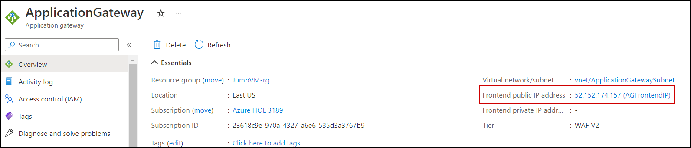

 1. To test the application copy and paste the Frontend public IP address of **Application Gateway** in a new browser tab.
 
      > **Note** : You will see that your website is running.
 
      
 
 1. Click on **windows (1)** menu then type **cmd (2)** after then right click on **Command Prompt (3)** and then select **Run as adminstrator (4)**.
 
      
 
 1. On the Command Prompt, type **ipconfig (1)** and then copy the **IPv4 Address (2)** and save it to notepad for later use.
 
      
 
 1. In azure portal, search **WAF (1)** and then select **Web Application Firewall policies (WAF) (2)**.
 
      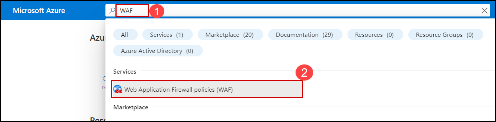
 
 1. On the WAF page, select your **firewallpolicy (1)**, and under settings, click on **Custom rules (2)** and  after that click on **+ Add custom rule (3)**.
 
      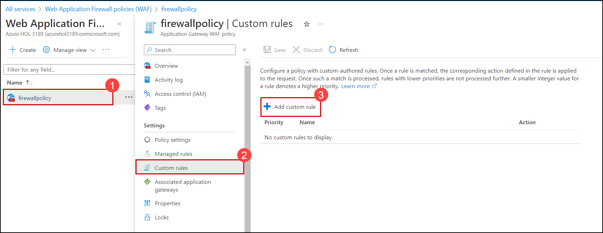
 
 1. On the **Add custom rule** blade, enter the following details
 
    - Custom rule name : **WAFcustomrule (1)**.
    - Priority : enter **1**.
    - IP address or range : Enter **IPv4 Address** that are copied above in step 5
    - Click on **Add (4)**.
 
      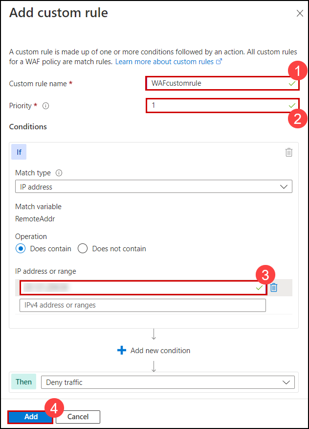
 
 1. Click on **Save**.
 
      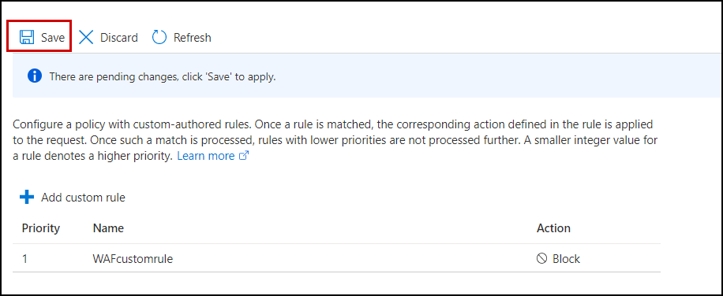

  1. Once the custom rule is created you will see the notification that says **Successfully updated the WAF policy**, as shown below.
 
      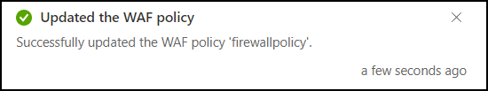
 
 1.  Now, navigate back to the tab where you browsed the IPv4 Address of Frontend public IP address of application gateway earlier and **refresh** the page. You can          observe the **403 Forbidden error**
 
     > **Note** : you will see that your website is Running.

 
      
 
 1. Now, you can paste the Frontend public IP address of **Application Gateway** in your **Local computer / Personal computer**.You can  observe the **403 Forbidden       error**
 
      > **Note** : you will see that your website is Blocked.
 
     


 ## Task 5 : Attack simulation 

      
In this task, you will be testing your application for security and perform sample attacks like XSS. Cross-Site Scripting (XSS) attacks are a type of injection, in which malicious scripts are injected into otherwise benign and trusted websites. XSS attacks occur when an attacker uses a web application to send malicious code, generally in the form of a browser side script, to a different end-user.

   > **Note** : You can perform this task only after finishing the task 2 and task 3.

1. You can perform a sample attack on your application by passing this **?q=<script>** value at the end of the web application URL or IP address.
    
1. Now pass the value **?q=<script>** at the end of your **Application Gateway** IP and try browsing it. You can observe the web application can be still accessible.
  
   > **Note** : Your browsing URL value should look ```http://20.185.224.102/?q=<script>```
    
   
  
1. To make your application more secure, select **ApplicationGateway** from the overview page of the resource group.
     
   
    
1. Under the **Application gateway** page, follow the below details:
     - Select **Web application firewall (1)** under **Settings**    
     - Click on **firewallpolicy** under **Associated web application firewall policy (2)**   
  
     
 
1. Under **firewallpolicy** page, go to the **Overview (1)** tab and click on **Switch to prevention mode (2)**.
 
    
    
1. Now, navigate back to the tab where you browsed the IP Address and refresh the page. You can observe the **403 Forbidden error**.
    
    
 
 1. Back again, on the **firewallpolicy** page, go to the **Overview (1)** tab and click on **Switch to detection mode (2)**.
 
     

