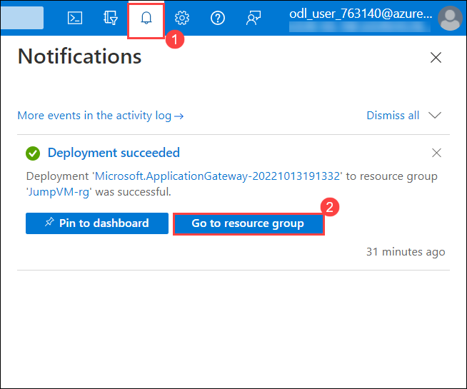

# Exercise 2: Azure Web Application Firewall on Application Gateway
## Lab objectives
In this lab, you will complete the following exercise:

1. Configure WAF to Protect your web application
2. Publish your application to the internet with the application gateway
3. Monitor attacks against your web application
4. Customize WAF rules
5. Attack simulation

### What is Azure Web Application Firewall ?
Microsoft Azure also has a WAF service that provides centralized protection of your web applications from common exploits and vulnerabilities. The Azure Web Application Firewall is one of the features of Azure Application Gateway (layer 7 load balancer) and its main goal is to protect a web application to common attack like SQL injections, cross-site scripting and others. Also it is following the Open Web Application Security Project (OWASP) Core Rule Set. Azure WAF service offers you to select some or all of the rules from the OWASP Core Rule Set.

Azure Application Gateway has a public IP, or front end, and your application users will use this IP address to connect to your application gateway. Application Gateway is going to take the incoming traffic and, based on a few rules, redirect the traffic to the appropriate back end in the backend pool. You can have app services, virtual machines, virtual machine scale sets, or even other IP addresses in the backend pools.

 
 
 ## Task 1: Configure WAF to Protect your web application
 
 1. Search **Application Gateway (1)** and then select **Application Gateway (2)**.
 
      
    
 1. Select your **Application Gateway**.

      
      
 1. On the Application gateway blade click on **Backend pools(1)** setting and then select on **AGBackendtarget(2)**.

     
     
 1. On **Edit backend pool** page, follow the below mentioned instructions:

    - **Target type** : Select **Virtual Machine (1)** from drop-down.
    - **Target** : Select **JumpVM-<inject key="Deployment ID" enableCopy="false"/>-nic (2)** from drop-down
    - Click on **Save (3)**

    

 1. Navigate back to home page and search for **Application Firewall Policies (1)** from search bar and select it **(2)**.

      
 
 1. Click on **firewallpolicy** under Web Application Firewall page and click on **Associated Application gateways** under Settings from Application Gateway WAF policy page.

     
     
 1. Under **Associated Application gateway** page, click on **+ Add association (1)** and select **Application Gateway(2)**

    
    
 1. Under **Associate an application gateway** page, enter below instructions:

    - **Application Gateway (WAF v2 SKU)** : Select **Aplication Gateway (1)** from drop-down 
    - **Check** the box next to **Apply the web Application Firewall policy configuration even it's different from current configuation (2) **
    - Click on **Add (3)**

    
    
1. Monitor the deployment status by selecting the **Notifications Bell (1)** icon at the top of the portal. In a minute or so, you should see a confirmation of the successful deployment. Select **Go to resource (2)**. This action will redirect you to the page.

    
    
 ## Task 2: Publish your application to the internet with the application gateway
 
In this task, you'll publish an application via Application Gateway.

1. On the Azure Portal **Home** page, search **Azure Firewall (1)** and then select **Firewalls (2)**.

   
    
1. Click on the firewall **AzureFirewall**.

   
     
1. Select **Firewall Manager (1)** from **Settings** and click on **Visit Azure Firewall Manager to configure and manage this firewall (2)**

   
    
1. Select **Azure Firewall Policies (1)** under **Firewall Manager** page and click on Firewall Policy **firewallpolicy (2)**.

   
   
1. Select **DNAT Rules (1)** from **Settings** tab under **Firewall Policy** page and select **+ Add a rule collection (2)**

   
    
1. Under **Add a rule collection** page, enter the below details:

    - Name: **afw-contoso-prod-firewall-rulecolection (1)**
    - Rule Collection type: **DNAT (2)**
    - Priority: **100 (3)**
    - Rule collection group: **DefaultDnatRuleCollectionGroup (4)**
    - Under **Rules (5)** mention the below details:
      - Name: **afw-dnat-http**
      - Source type: Select **IP Address** from the drop-down list
      - Source: Enter *
      - Protocol: Select **TCP** from the drop-down list
      - Destination Ports: **80**
      - Destination type: Select **IP Address** from the drop-down list
      - Destination : Enter the IP address of **Firewall** 
      - Translated address: Enter the Public IP address of **Application gateway**. 
      - Translated port: **80**
     
     - Click on **Add (6)**

       
          
1. Now, to test the application copy and paste the Public IP address of **Application** in a new browser tab.

   
       
  > **Note** : This will confirm that you have published the Contoso web application via Application Gateway.

  

      
