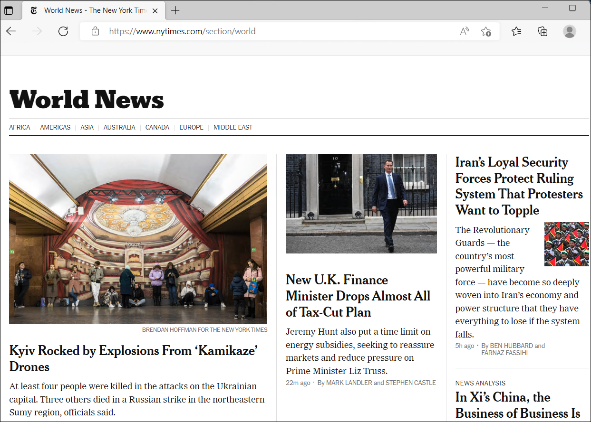

# Exercise 3: Azure Firewall Premium

Azure Firewall is a cloud-native and intelligent network firewall security service that provides the best of breed threat protection for your cloud workloads running in Azure. It's a fully stateful, firewall as a service with built-in high availability and unrestricted cloud scalability. It provides both east-west and north-south traffic inspection.

Azure Firewall Premium is a next generation firewall with capabilities that are required for highly sensitive and regulated environments. It includes the following features:

- **TLS Inspection** - decrypts outbound traffic, processes the data, then encrypts the data and sends it to the destination.
- **IDPS** - A network intrusion detection and prevention system (IDPS) allows you to monitor network activities for malicious activity, log information about this activity, report it, and optionally attempt to block it.
- **URL filtering** - extends Azure Firewall’s FQDN filtering capability to consider an entire URL. For example, `www.contoso.com/a/c` instead of `www.contoso.com`.
- **Web categories** - administrators can allow or deny user access to website categories such as gambling websites, social media websites, and others.
For more information, see https://learn.microsoft.com/en-us/azure/firewall/premium-features
 
## Test the Firewall

In this exercise, you will explore on Azure Firewall premium features. 

# Task 1: Add firewall diagnostics settings 

In this task, you will enable diagnostic settings in Azure Firewall to collect firewall logs.

1. In the Azure portal, navigate to your **JumpVM-rg** resource group and select the AzureFirewall resource.

   

2. On the firewall page, under **Monitoring**, select **Diagnostic settings**.

   

3. Select **Add diagnostic setting** on the **Diagnostic settings**. 

   

4. Enter **Diagnostic setting name** as **fw-diagnostics**.

   

5. Under **Logs**, select **AzureFirewallApplicationRule**, and **AzureFirewallNetworkRule**.

   

6. Under **Destination details**, select **Send to Log Analytics workspace** and then click on **Save**.

   
   
## IDPS Tests

Azure Firewall Premium provides signature-based IDPS to allow rapid detection of attacks by looking for specific patterns, such as byte sequences in network traffic, or known malicious instruction sequences used by malware.

# Task 2: Test IDPS for HTTP traffic

In this task, you will test IDPS for HTTP traffic

1. On the JumpVM virtual machine, search for **Command Prompt (1)** and open  **Command Prompt (2)** window.

   

2. Type the following command at the command prompt:

   - Replace <your web server address> with JumpVm IP.

     `curl -A "HaxerMen" <your web server address>`
 
    
 
 3. In the custom prompt you will see your Web server response.
 
    
 
 4. Navigate to the Firewall Network rule logs on the Azure portal to find an alert similar to the following message:

    ```
    { “msg” : “TCP request from 10.0.100.5:16036 to 10.0.20.10:80. Action: Alert. Rule: 2032081. IDS: 
    USER_AGENTS Suspicious User Agent (HaxerMen). Priority: 1. Classification: A Network Trojan was 
    detected”}
    ```

    > [!NOTE]
    > It can take some time for the data to begin showing in the logs. Give it at least a couple of minutes to allow for the logs to begin showing the data.
 
5. Now navigate back to firewall policy and under **Settings** select **IDPS**.
 
   
 
6. On the **IDPS** page select **Signature rules (1)** tab and under **Signature ID**, in the open text box type **2032081 (2)**.
 
   
 
7. Select **2032081 (1)** signature id and click on **Edit Rules (2)**.
 
   
 
8. Under edit rules change **Signature Mode** to **Alert and Deny** and click on **Save**.  Wait for the deployment to complete before proceeding.
 
   

9. Navigate back to WorkerVM, and run the `curl` command again:

   `curl -A "HaxerMen" <your web server address>`

   Since the HTTP request is now blocked by the firewall, you'll see the following output after the connection timeout expires:

   `curl: (56) Recv failure: Connection was reset`
 
    

10. Go to the Monitor logs in the Azure portal and find the message for the blocked request.
 
# Task 4: Web categories testing
 
In this task, you will create an application rule to allow access to sports websites.

1. In the Azure portal, navigate to your **JumpVM-rg** resource group and select **firewallpolicy**.
 
   
 
2. Select **Application Rules (1)** from the **Settings** tab under the Firewall Policy page and select **+ Add a rule collection (2)**.
   
   
 
3. Under the **Add a rule collection** page, enter the below details:
 
    - Name: **GeneralWeb (1)**
    - Rule Collection type: **Application (2)**
    - Priority: **103 (3)**
    - Rule collection group: **DefaultApplicationRuleCollectionGroup (4)**
    - Under **Rules (5)** mention the below details:
      - Name: **AllowSports**
      - Source type: Select **IP Address** from the drop-down list
      - Source: Enter *
      - Protocol: Enter **http,https**
      - TLS inspection: Check TLS inspection
      - Destination Type: Select **Web categories**
      - Destination: Enter `Sports`
     
     - Click on **Add (6)**
 
     
 
 4. Once the deployment completes open a browser on JumpVM, navigate to `https://www.nfl.com` and verify you are able to see the NFL web page.
 
    
 
 5. Now navigate to your log analytics workspace and in the Application rule Monitoring logs review the **web Category: Sports rule** was matched and the request was allowed.
 
  

# Task 5: Implement and Test URL filtering
 
 1. In the Azure portal, navigate to your **JumpVM-rg** resource group and select **firewallpolicy**.
 
    
 
 2. Select **Application Rules (1)** from the **Settings** tab under Firewall Policy page and select **+ Add a rule collection (2)**.
 
    
 
 3. Under **Add a rule collection** page, enter the below details:

    - Name: **Firewall-rulecollection (1)**
    - Rule Collection type: **Application (2)**
    - Priority: **100 (3)**
    - Rule collection group: **DefaultApplicationRuleCollectionGroup (4)**
    - Under **Rules (5)** mention the below details:
      - Name: **URLFiltering**
      - Source type: Select **IP Address** from the drop-down list
      - Source: Enter *
      - Protocol: Enter **http,https**
      - TLS inspection : Check TLS inspection
      - Destination Type: Select **URL**
      - Destination: Enter `www.nytimes.com/section/world`
     
     - Click on **Add (6)**
 
     
 
 4. Once the deployment completes open a browser on JumpVM, navigate to `https://www.nytimes.com/section/world` and validate that the HTML response is displayed as expected in the browser.

    
 
 5. In the Azure portal, navigate to your log analytics workspace and in Application rule monitoring logs review the entire URL.
 
 
 # Task 6: DDOS protection
 
 ## What is DDoS protection?

Distributed denial of service (DDoS) attacks are some of the largest availability and security concerns facing customers that are moving their applications to the cloud. A DDoS attack attempts to exhaust an application's resources, making the application unavailable to legitimate users. DDoS attacks can be targeted at any endpoint that is publicly reachable through the internet.

Azure DDoS Protection, combined with application design best practices, provides enhanced DDoS mitigation features to defend against DDoS attacks. It's automatically tuned to help protect your specific Azure resources in a virtual network. Protection is simple to enable on any new or existing virtual network, and it requires no application or resource changes.

  


## Types of attacks Azure DDoS Protection mitigates

- **Volumetric attacks**: These attacks flood the network layer with a substantial amount of seemingly legitimate traffic. They include UDP floods, amplification floods, and other spoofed-packet floods. DDoS Protection mitigates these potential multi-gigabyte attacks by absorbing and scrubbing them, with Azure's global network scale, automatically.
- **Protocol attacks**: These attacks render a target inaccessible, by exploiting a weakness in the layer 3 and layer 4 protocol stack. They include SYN flood attacks, reflection attacks, and other protocol attacks. DDoS Protection mitigates these attacks, differentiating between malicious and legitimate traffic, by interacting with the client, and blocking malicious traffic.
- **Resource (application) layer attacks**: These attacks target web application packets, to disrupt the transmission of data between hosts. They include HTTP protocol violations, SQL injection, cross-site scripting, and other layer 7 attacks. Use a Web Application Firewall, such as the Azure Application Gateway web application firewall, as well as DDoS Protection to provide defense against these attacks. There are also third-party web application firewall offerings available in the Azure Marketplace.

1. In Azure portal, search **DDoS protection plans (1)** and then select **DDoS protection plans (2)**.
 
   
 
1. Click on create.
 
    
 
1. On **DDos protection** page, provide the information as mentioned below,
   - Subscription: **Leave it as default (1)**.
   - Resource Group: **JumpVM-rg (2)**.
   - Name: Enter **DDoSprotection (3)**.
   - Region: **<inject key="Region" />**.
   - Click on **Next-Tags**.
 
     
 
1. On the **Tags** tab, leave everything to default and then  click on **Review + create**.
 
     
  
1. If the validation is passed then  click on **Create**.

    >**NOTE**: It may take a couple of minutes for the workspace to be created.

      
 
1. Once the DDoS protection is added you will see a notification that says **Deployment succeded**, as shown below.

      
 
1. On DDoS protection page, under setting click on **Protected resources (1)** and then select the **vnet (2)**, and click on **Add (3)**.
 
      

1. On the **Add virtual network  to DDoS plan** blade, provide the information as mentioned below,
    - Subscription: **Leave it as default (1)**.
    - Resource Group: **JumpVM-rg (2)**.
    - Virtual network : Select **vnet (3)**.
    - Click on **Add (4)**
   
      
 
1. Once the Protected resources is added you will see a notification that says **Successfully updated the virtual network vnet**, as shown below.
 
      
 
1. Now, In Azure portal, search **Firewall Manager (1)** and then select **Firewall Manager (2)**.
 
      

1. Under setting click on **Virtual Network**, and you will see that you are protected.
 
      
    

