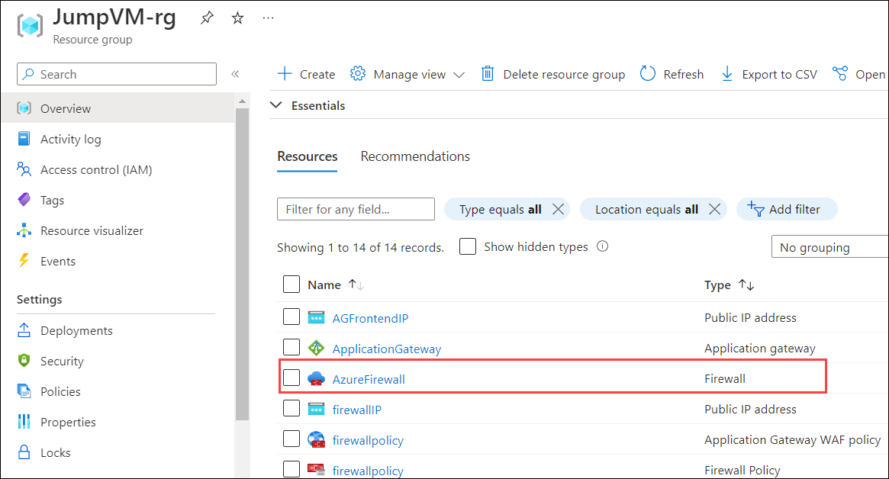
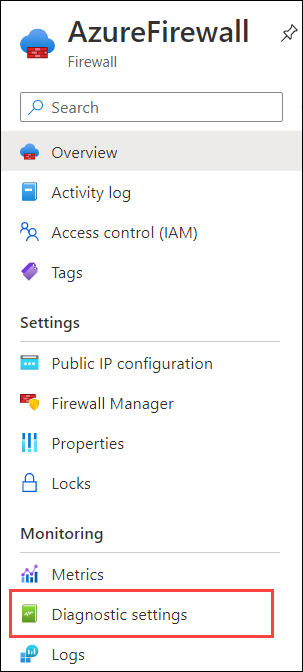
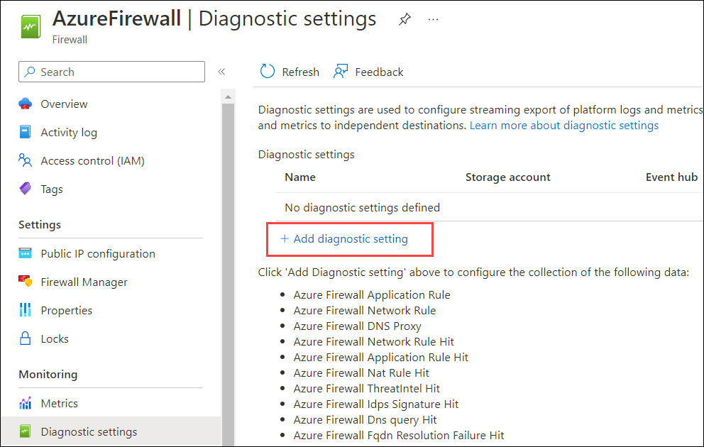
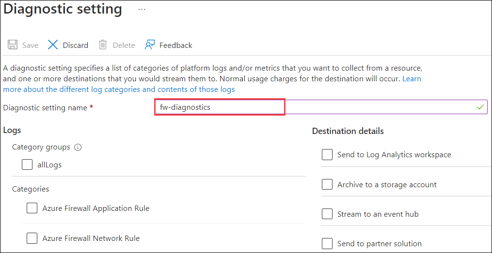
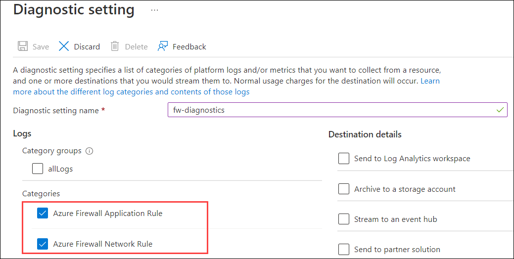
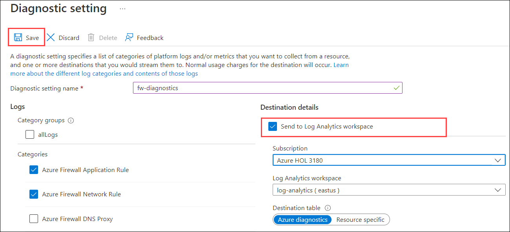

# Exercise 3: Azure Firewall Premium

Azure Firewall is a cloud-native and intelligent network firewall security service that provides the best of breed threat protection for your cloud workloads running in Azure. It's a fully stateful, firewall as a service with built-in high availability and unrestricted cloud scalability. It provides both east-west and north-south traffic inspection.

Azure Firewall Premium is a next generation firewall with capabilities that are required for highly sensitive and regulated environments. It includes the following features:

- **TLS Inspection** - decrypts outbound traffic, processes the data, then encrypts the data and sends it to the destination.
- **IDPS** - A network intrusion detection and prevention system (IDPS) allows you to monitor network activities for malicious activity, log information about this activity, report it, and optionally attempt to block it.
- **URL filtering** - extends Azure Firewall’s FQDN filtering capability to consider an entire URL. For example, `www.contoso.com/a/c` instead of `www.contoso.com`.
- **Web categories** - administrators can allow or deny user access to website categories such as gambling websites, social media websites, and others.
For more information, see https://learn.microsoft.com/en-us/azure/firewall/premium-features
 
 
## Test the firewall

In this exercise you will explore on Azure Firewall premium features. 

### Add firewall diagnostics settings 

In this task you will enable diagnostic settings in Azure Firewall to collect firewall logs.

1. In the Azure portal, navigate to your **JumpVM-rg** resource group and select the AzureFirewall resource.

   

2. On the firewall page, under **Monitoring**, select **Diagnostic settings**.

   

3. Select **Add diagnostic setting** on the **Diagnostic settings**. 

   

4. Now for **Diagnostic setting name** enter **fw-diagnostics**.

   

5. Under **Logs**, select **AzureFirewallApplicationRule**, and **AzureFirewallNetworkRule**.

   

6. Under **Destination details**, select **Send to Log Analytics workspace** and then click on **Save**.

   
   
### IDPS Tests

Azure Firewall Premium provides signature-based IDPS to allow rapid detection of attacks by looking for specific patterns, such as byte sequences in network traffic, or known malicious instruction sequences used by malware.

In this task you will test IDPS for http and https traffic

### Test IDPS for HTTP traffic

1. On the JumpVM irtual machine, search for command prompt and open administrator command prompt window.

2. Type the following command at the command prompt:

   - Replace <your web server address> with JumpVm IP.

    `curl -A "HaxerMen" <your web server address>`
 
 3. In the custom prompt you will see your Web server response.
 
 4. Navigate to the Firewall Network rule logs on the Azure portal to find an alert similar to the following message:

   ```
   { “msg” : “TCP request from 10.0.100.5:16036 to 10.0.20.10:80. Action: Alert. Rule: 2032081. IDS: 
   USER_AGENTS Suspicious User Agent (HaxerMen). Priority: 1. Classification: A Network Tojan was 
   detected”}
   ```

   > [!NOTE]
   > It can take some time for the data to begin showing in the logs. Give it at least a couple minutes to allow for the logs to begin showing the data.
 
5. Add a signature rule for signature 2032081:

   1. Select the **DemoFirewallPolicy** and under **Settings** select **IDPS**.
   1. Select the **Signature rules** tab.
   1. Under **Signature ID**, in the open text box type *2032081*.
   1. Under **Mode**, select **Deny**.
   1. Select **Save**.
   1. Wait for the deployment to complete before proceeding.


6. On WorkerVM, run the `curl` command again:

   `curl -A "HaxerMen" <your web server address>`

   Since the HTTP request is now blocked by the firewall, you'll see the following output after the connection timeout expires:

   `read tcp 10.0.100.5:55734->10.0.20.10:80: read: connection reset by peer`

7. Go to the Monitor logs in the Azure portal and find the message for the blocked request.
<!---8. Now you can bypass the IDPS function using the **Bypass list**.

   1. On the **IDPS (preview)** page, select the **Bypass list** tab.
   2. Edit **MyRule** and set **Destination** to *10.0.20.10, which is the ServerVM private IP address.
   3. Select **Save**.


