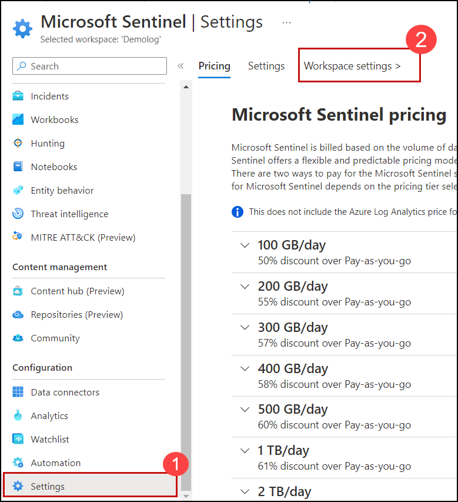
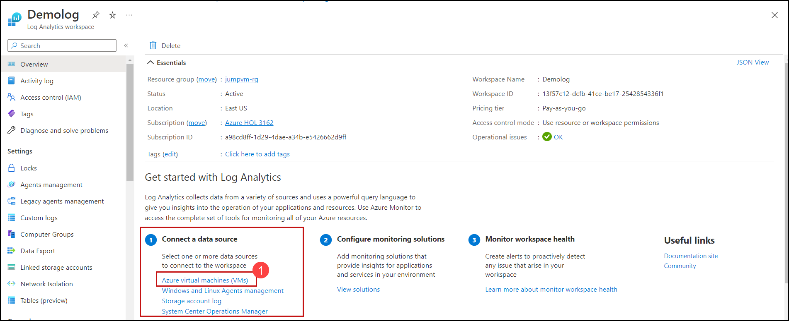
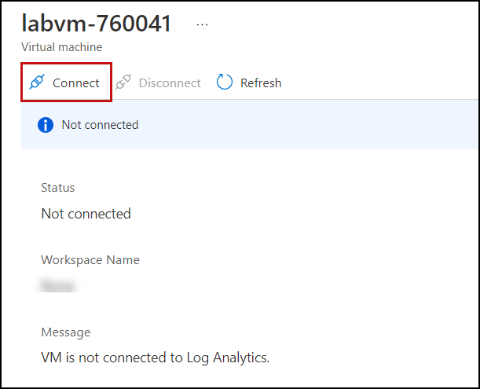
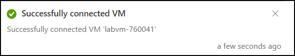
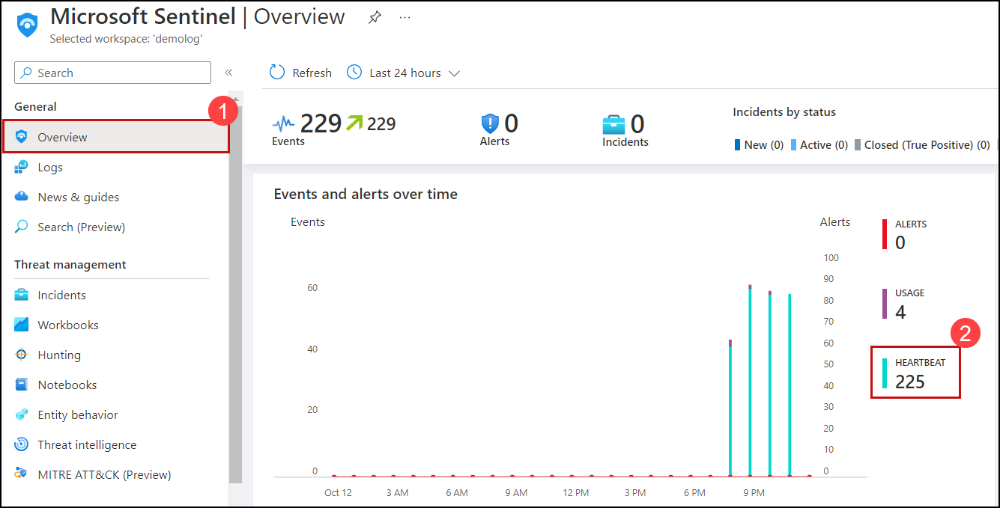

# Exercise 4: Azure Sentinel
## Lab objectives
In this lab, you will complete the following exercise:
1. What is Microsoft Sentinel
1. Onboard Azure Subscription to Azure sentinel
1. Onboard the Web App – IaaS server to sentinel
1. Explore and query logs

# Task 1: What is Microsoft Sentinel?

Microsoft Sentinel is a scalable, cloud-native solution that provides:
- Security information and event management (SIEM).
- Security orchestration, automation, and response (SOAR).

 Microsoft Sentinel delivers intelligent security analytics and threat intelligence across the enterprise. With Microsoft Sentinel, you get a single solution for attack detection, threat visibility, proactive hunting, and threat response.

Microsoft Sentinel is your bird's-eye view across the enterprise alleviating the stress of increasingly sophisticated attacks, increasing volumes of alerts, and long resolution time frames.
1. **Collect data at cloud scale** across all users, devices, applications, and infrastructure, both on-premises and in multiple clouds.
1. **Detect previously undetected threats**, and minimize false positives using Microsoft's analytics and unparalleled threat intelligence.
1. **Investigate threats with artificial intelligence**, and hunt for suspicious activities at scale, tapping into years of cyber security work at Microsoft.
1. **Respond to incidents rapidly** with built-in orchestration and automation of common tasks.

    
    
# Task 2: Onboard Azure Subscription to Azure sentinel

1. In Azure portal, Search **microsoft-sentinel (1)** and Select **microsoft-sentinel (2)**.

    
 
1. On the Microsoft Sentinel page, Click on **Create**.

    

1. If there is no already a Log Analytic workspace that you can use click **Create a new workspace**.

     
     
1. On **Log Analytics workspace** page, provide the information as mentioned below,
   - Subscription: **Leave it as default**
   - Resource Group: Enter **JumpVM-rg**.
   - Name: Enter a Unique value.
   - Region: Select **East US** from the drop-down list
   - Click on **Review and Create** to continue.

     
  
1. If Validations is passed click on **Create** to create your new Log Analytics workspace.

     
    
   >**NOTE**: It may take a Couple of minutes for the workspace to be Created.

1. Once the Log Analytics workspace is added you will see notification which says **Successfully added Log Analytics workspace** as shown below.

      

1. Click on **ADD**.

      
      
1. Once the Microsoft Sentinel is added you will see another notification which says **Successfully added Azure Sentinel** as shown below.

      

1. This is the default page you will be taken to once your new Azure Sentinel instance has been created. After this, the overview page will be the default page shown.

     
     

     
     
# Task 3: Onboard the Web App – IIS server to sentinel

# Task 4: Explore Azure Sentinel and query logs

1. Now, click on the **Workbooks** from the left pane under the Threat Management section and search for WAF and select **Microsoft Web Application Firewall (WAF) -      Azure WAF** from the search result.

    

1. Then from the bottom-right corner of the Azure portal, click on **Save** and then on **OK** to save the workbook.

    
    
1. Once the **Workbook** is added. you will see notification which says **Workbook 'Microsoft Web Application Firewall (WAF) - Azure WAF saved successfully** as shown    below.

   

1. On Microsoft Sentinel blade, under configuration click on **Setting (1)** and then click on **workspace settings**.

    

1. On the Log Analytics workspace page, under Connect a data source click on **Azure virtual machines (VMs) (1)**.

    

1. You will see that virtual machine is not connected with Log Analytics connection. So now click on **VM Name** to connect with Log Analytics connection

    
      
1. Click on **Connect**.

    
     
1. Once the VM is connected you will see the notification which says **Successfully connected virtual machine** as shown below.

    

1. Now, go back to **Microsoft Sentinel Overview** blade by clicking on Overview under General section on the left and, then click on **Heartbeat** to query the           VM insights. Count of **Events** could be different on your Microsoft Sentinel Dashboard.

    >**NOTE**: Wait for 20 minutes and then Refresh the browser page to see the overview data.
     
    

1. Click on **Run** You will see results for **union Heartbeat** in query explorer. You can see operations around Network, Logical Disk, Memory, and Processor for        VM. If you are not able to see the results, then try to adjust the query editor size and you will be able to see the outcome.

    
     
1. You can save the query for later use by clicking on the **Save (1)** and then **Save as query (2)** button.
  
     

1. Now, provide **VMProcess** for the **Query name (1)**, then click on **Save (2)**.

    

1. Once the Query is saved you will see the notification which says **Successfully saved query** as shown below.

    

1. You can see and run the saved **queries** by browsing to **Queries**

    

1. Under all queries select **others (1)** then, you will find `VMProcess` query under **Queries**, and then click on **Run** to run the querie.

    
