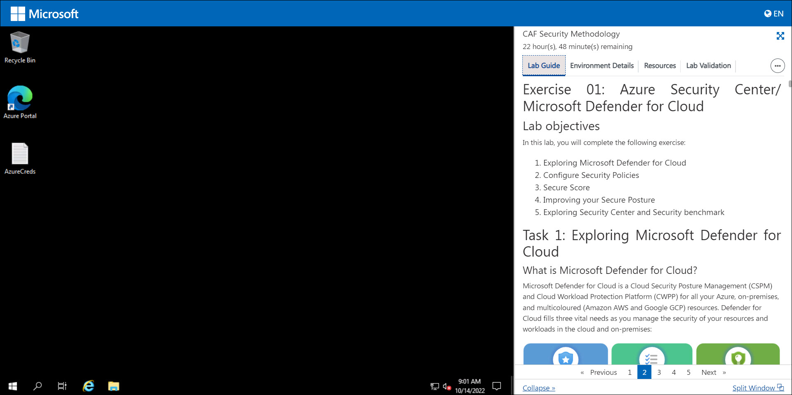
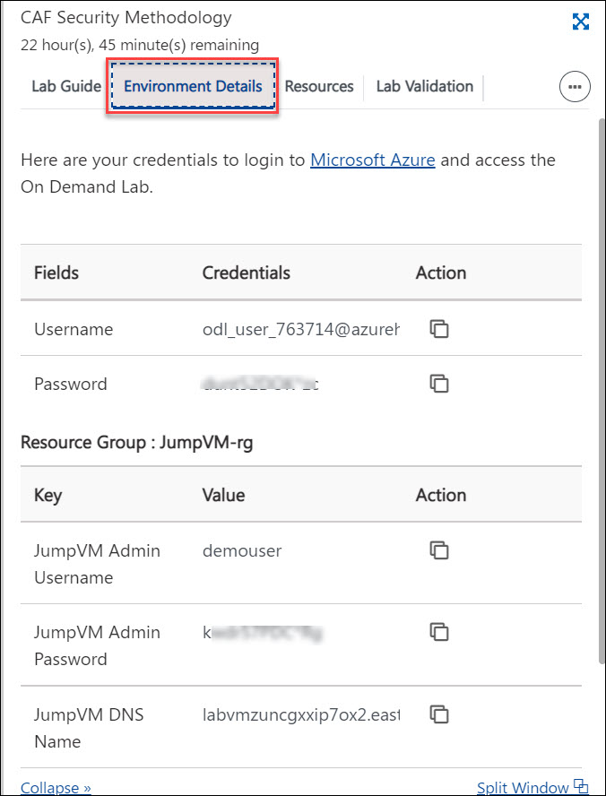
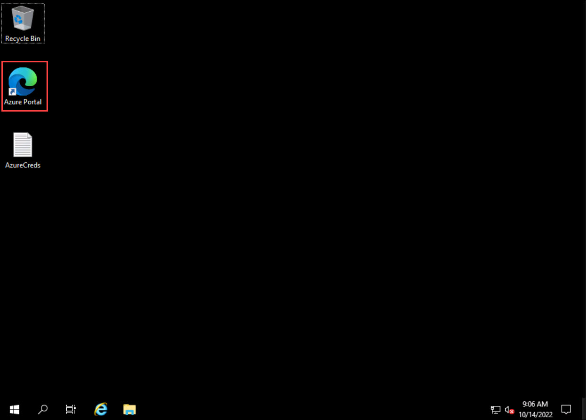
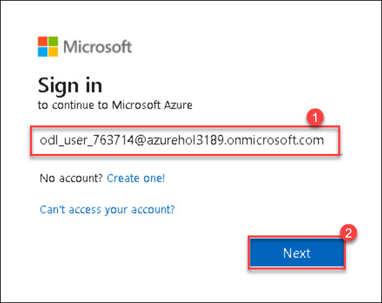
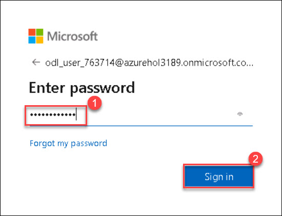
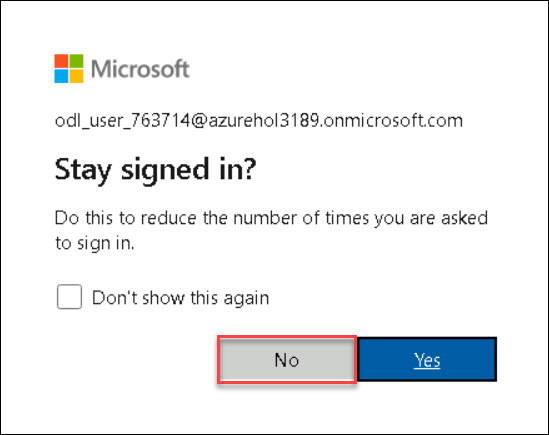
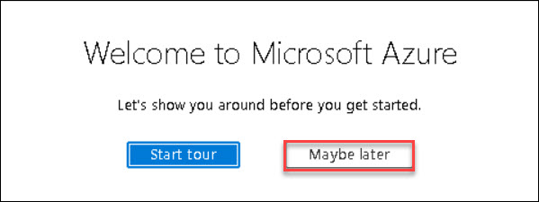

# Getting Started with Lab	

1. Once you launch the lab, a virtual machine (JumpVM) on the left and a lab guide on the right will get loaded in your browser. Use this virtual machine throughout the workshop to perform the lab.	

   	

2. To get lab environment details, click on the **Environment Details** tab located next to the *Lab Guide* tab. 	

   	

## Log in to Azure Portal

1. In the JumpVM, double click on the **Azure portal shortcut** on the desktop. if you get welcome screen of edge browser, click on **Start without your data**, on next screen click on **Continue without your data** and on next screen click on **Confirm and start browsing**.

     

2. Login to Azure with the username **<inject key="AzureAdUserEmail" />** (1) and click on **Next** (2).

   

3. Enter password **<inject key="AzureAdUserPassword" />** (1) and click on **Sign in** (2).

   
   
   >**Note:** If there's a popup entitled **More information required**, then click on **Skip for now (14 days until this is required)**.
   
   

   >**Note:** If there's a popup entitled **Stay signed in?** with buttons for **No** and **Yes**, Choose **No**.
   
   
     
   >**Note:** If there's another popup entitled **Welcome to Microsoft Azure** with buttons for **Start Tour** and **Maybe Later** - Choose **Maybe Later**.
   
   
   
4. **Close** the recommendation page by clicking on the X mark.
  
5. Click on the **Next** button present in the bottom-right corner of the lab guide to start with the first exercise of the lab.

   
